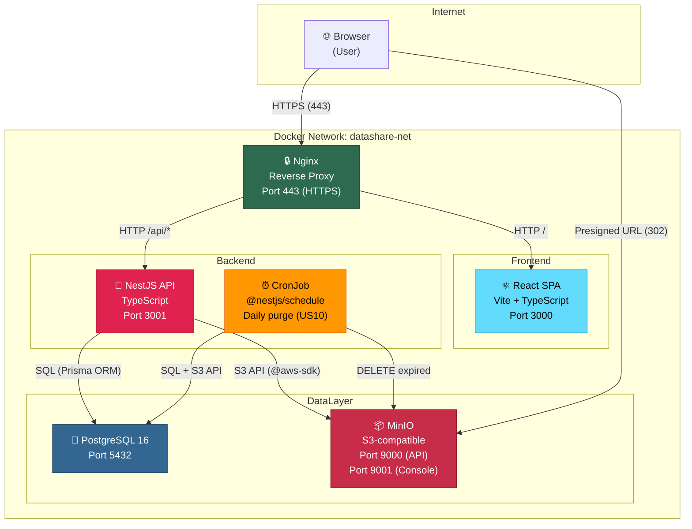

# DataShare — Architecture Overview

## 1. Application Architecture Diagram

### Architecture Notes

- **Single entry point**: Only Nginx is exposed on host port 443 (HTTPS)
- **Internal communication**: All services communicate via Docker bridge network `datashare-net`
- **Presigned URLs**: Download flow uses MinIO presigned URLs — NestJS generates the URL, browser follows 302 redirect directly to MinIO (no file proxy through backend)
- **CronJob**: Runs inside the NestJS container via `@nestjs/schedule`, purges expired files daily at midnight

### Protocol Summary

| From | To | Protocol | Purpose |
|------|----|----------|---------|
| Browser | Nginx | HTTPS (TLS) | All client requests |
| Nginx | React | HTTP | Serve SPA static assets |
| Nginx | NestJS | HTTP | API requests `/api/*` |
| NestJS | PostgreSQL | TCP (SQL via Prisma) | Data persistence |
| NestJS | MinIO | HTTP (S3 API) | File upload/delete, presigned URL generation |
| Browser | MinIO | HTTPS (presigned) | Direct file download (302 redirect) |
| CronJob | PostgreSQL + MinIO | SQL + S3 API | Daily purge of expired files |

---

## 2. Technology Choices (Justified)

| Element | Technology Chosen | Alternatives | Justification |
|---------|------------------|-------------|---------------|
| **Language** | TypeScript | Java, C#, PHP | End-to-end type safety (front + back), large ecosystem, fast development cycle |
| **Back-end** | NestJS 10.x | Spring Boot, .NET Core, Symfony | TypeScript native, modular architecture with DI, built-in Swagger/OpenAPI, Jest integrated |
| **Front-end** | React 18.x + Vite | Angular, VueJS | Largest community and ecosystem, TypeScript consistency with NestJS, Vite for fast HMR |
| **Database** | PostgreSQL 16 | MongoDB | ACID compliance, robust relational model, JSON support, industry standard |
| **ORM** | Prisma 5.x | TypeORM, Sequelize | Auto-generated TypeScript types, declarative schema, clean migrations, excellent DX |
| **File Storage** | MinIO (S3-compatible) | Local filesystem | Full AWS S3 API compatibility, self-hosted for Docker demo, presigned URLs for secure downloads |
| **Authentication** | JWT (access + refresh) | OAuth2, sessions | Required by specs (US03/US04), stateless access token (15min), refresh in HttpOnly cookie (7d) |
| **Reverse Proxy** | Nginx (Alpine) | Traefik, Caddy | Lightweight, battle-tested, simple config for routing `/` and `/api` |
| **Testing (unit)** | Jest | Vitest, Mocha | Native NestJS integration, 70% coverage target from specs |
| **Testing (E2E)** | Cypress | Playwright, Selenium | Explicitly required by specs, excellent DX for UI testing |
| **Lint / Format** | ESLint + Prettier | TSLint (deprecated) | Industry standard for TypeScript, auto-fixable, CI-ready |
| **Scheduler** | @nestjs/schedule | Bull, Agenda | Native NestJS module, simple cron decorator, no external dependency needed for MVP |
| **Deployment** | Docker Compose v2 | Kubernetes | Required by specs for local demo, simple multi-service orchestration |

### Why NestJS over other back-end options?

1. **TypeScript end-to-end**: Same language as React front-end, shared types possible via monorepo
2. **OpenAPI/Swagger native**: `@nestjs/swagger` auto-generates API documentation from decorators
3. **Dependency Injection**: Modular, testable architecture out of the box
4. **Jest built-in**: Testing framework pre-configured, aligns with 70% coverage requirement
5. **Ecosystem maturity**: Large community, extensive documentation, active maintenance

### Why React over Angular/VueJS?

1. **Market adoption**: Most widely used front-end library, easier hiring
2. **Flexibility**: Not opinionated — choose the right tools per feature (React Query, React Router, etc.)
3. **TypeScript cohesion**: Consistent with NestJS backend, potential for shared types
4. **Vite**: Fastest development server, instant HMR, optimized production builds
