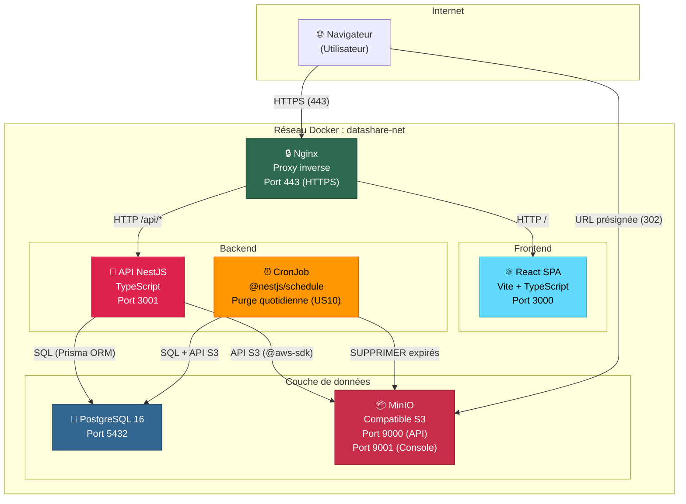

# DataShare — Vue d'ensemble de l'architecture

## 1. Diagramme d'architecture applicative

```mermaid
graph TD
    subgraph Internet
        Browser["🌐 Navigateur<br/>(Utilisateur)"]
    end

    subgraph DockerNetwork["Réseau Docker : datashare-net"]
        Nginx["🔒 Nginx<br/>Proxy inverse<br/>Port 443 (HTTPS)"]

        subgraph Frontend
            React["⚛️ React SPA<br/>Vite + TypeScript<br/>Port 3000"]
        end

        subgraph Backend
            NestJS["🚀 API NestJS<br/>TypeScript<br/>Port 3001"]
            Cron["⏰ CronJob<br/>@nestjs/schedule<br/>Purge quotidienne (US10)"]
        end

        subgraph DataLayer["Couche de données"]
            Postgres["🐘 PostgreSQL 16<br/>Port 5432"]
            MinIO["📦 MinIO<br/>Compatible S3<br/>Port 9000 (API)<br/>Port 9001 (Console)"]
        end
    end

    Browser -->|"HTTPS (443)"| Nginx
    Nginx -->|"HTTP /&nbsp;"| React
    Nginx -->|"HTTP /api/*"| NestJS
    NestJS -->|"SQL (Prisma ORM)"| Postgres
    NestJS -->|"API S3 (@aws-sdk)"| MinIO
    Cron -->|"SQL + API S3"| Postgres
    Cron -->|"SUPPRIMER expirés"| MinIO
    Browser -->|"URL présignée (302)"| MinIO

    style Nginx fill:#2d6a4f,stroke:#1b4332,color:#fff
    style React fill:#61dafb,stroke:#21a1c4,color:#000
    style NestJS fill:#e0234e,stroke:#b71c3c,color:#fff
    style Postgres fill:#336791,stroke:#1d3f5e,color:#fff
    style MinIO fill:#c72c48,stroke:#8b1a2b,color:#fff
    style Cron fill:#ff9800,stroke:#e65100,color:#000
```

### Notes sur l'architecture

- **Point d'entrée unique** : Seul Nginx est exposé sur le port hôte 443 (HTTPS)
- **Communication interne** : Tous les services communiquent via le réseau bridge Docker `datashare-net`
- **URLs présignées** : Le flux de téléchargement utilise les URLs présignées MinIO — NestJS génère l'URL, le navigateur suit la redirection 302 directement vers MinIO (pas de proxy fichier via le backend)
- **CronJob** : S'exécute dans le conteneur NestJS via `@nestjs/schedule`, purge les fichiers expirés quotidiennement à minuit

### Résumé des protocoles

| De | Vers | Protocole | Objectif |
|------|----|----------|---------|
| Navigateur | Nginx | HTTPS (TLS) | Toutes les requêtes client |
| Nginx | React | HTTP | Servir les assets statiques du SPA |
| Nginx | NestJS | HTTP | Requêtes API `/api/*` |
| NestJS | PostgreSQL | TCP (SQL via Prisma) | Persistance des données |
| NestJS | MinIO | HTTP (API S3) | Upload/suppression de fichiers, génération d'URLs présignées |
| Navigateur | MinIO | HTTPS (présignée) | Téléchargement direct de fichiers (redirection 302) |
| CronJob | PostgreSQL + MinIO | SQL + API S3 | Purge quotidienne des fichiers expirés |

---

## 2. Choix technologiques (justifiés)

| Élément | Technologie choisie | Alternatives | Justification |
|---------|------------------|-------------|---------------|
| **Langage** | TypeScript | Java, C#, PHP | Typage de bout en bout (front + back), large écosystème, cycle de développement rapide |
| **Back-end** | NestJS 10.x | Spring Boot, .NET Core, Symfony | Natif TypeScript, architecture modulaire avec injection de dépendances, Swagger/OpenAPI intégré, Jest intégré |
| **Front-end** | React 18.x + Vite | Angular, VueJS | Plus grande communauté et écosystème, cohérence TypeScript avec NestJS, Vite pour un HMR rapide |
| **Base de données** | PostgreSQL 16 | MongoDB | Conformité ACID, modèle relationnel robuste, support JSON, standard de l'industrie |
| **ORM** | Prisma 5.x | TypeORM, Sequelize | Types TypeScript auto-générés, schéma déclaratif, migrations propres, excellente expérience développeur |
| **Stockage de fichiers** | MinIO (compatible S3) | Système de fichiers local | Compatibilité totale avec l'API AWS S3, auto-hébergé pour la démo Docker, URLs présignées pour les téléchargements sécurisés |
| **Authentification** | JWT (access + refresh) | OAuth2, sessions | Requis par les spécifications (US03/US04), jeton d'accès sans état (15 min), refresh dans cookie HttpOnly (7 j) |
| **Proxy inverse** | Nginx (Alpine) | Traefik, Caddy | Léger, éprouvé, configuration simple pour le routage `/` et `/api` |
| **Tests (unitaires)** | Jest | Vitest, Mocha | Intégration native NestJS, objectif de couverture de 70 % selon les spécifications |
| **Tests (E2E)** | Cypress | Playwright, Selenium | Explicitement requis par les spécifications, excellente expérience développeur pour les tests UI |
| **Lint / Format** | ESLint + Prettier | TSLint (obsolète) | Standard de l'industrie pour TypeScript, auto-correction, prêt pour la CI |
| **Planificateur** | @nestjs/schedule | Bull, Agenda | Module natif NestJS, simple décorateur cron, aucune dépendance externe nécessaire pour le MVP |
| **Déploiement** | Docker Compose v2 | Kubernetes | Requis par les spécifications pour la démo locale, orchestration multi-services simple |

### Pourquoi NestJS plutôt que d'autres options back-end ?

1. **TypeScript de bout en bout** : Même langage que le front-end React, possibilité de partager les types via un monorepo
2. **OpenAPI/Swagger natif** : `@nestjs/swagger` génère automatiquement la documentation API à partir des décorateurs
3. **Injection de dépendances** : Architecture modulaire et testable par défaut
4. **Jest intégré** : Framework de tests pré-configuré, aligné avec l'exigence de couverture à 70 %
5. **Maturité de l'écosystème** : Grande communauté, documentation extensive, maintenance active

### Pourquoi React plutôt qu'Angular/VueJS ?

1. **Adoption sur le marché** : Bibliothèque front-end la plus utilisée, recrutement facilité
2. **Flexibilité** : Non opinioné — choisir les bons outils par fonctionnalité (React Query, React Router, etc.)
3. **Cohérence TypeScript** : Consistant avec le backend NestJS, potentiel de types partagés
4. **Vite** : Serveur de développement le plus rapide, HMR instantané, builds de production optimisés
