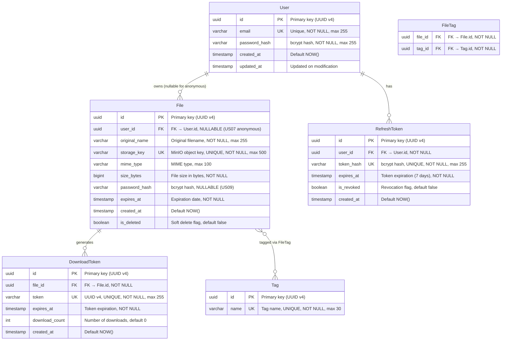

# DataShare — Database Schema (MCD)

## Entity-Relationship Diagram

## Entity Details

### User (US03, US04)

Registered users who can upload and manage files.

| Column | Type | Constraints | Description |
|--------|------|-------------|-------------|
| `id` | UUID | PK, default `gen_random_uuid()` | Unique user identifier |
| `email` | VARCHAR(255) | UNIQUE, NOT NULL | User email (login identifier) |
| `password_hash` | VARCHAR(255) | NOT NULL | bcrypt hash (salt rounds = 12) |
| `created_at` | TIMESTAMP | NOT NULL, default `NOW()` | Registration date |
| `updated_at` | TIMESTAMP | NOT NULL, default `NOW()` | Last profile update |

**Indexes**: `UNIQUE(email)`

---

### File (US01, US06, US07, US09, US10)

Uploaded files metadata. The actual file is stored in MinIO.

| Column | Type | Constraints | Description |
|--------|------|-------------|-------------|
| `id` | UUID | PK, default `gen_random_uuid()` | Unique file identifier |
| `user_id` | UUID | FK → User.id, **NULLABLE** | Owner (NULL = anonymous upload, US07) |
| `original_name` | VARCHAR(255) | NOT NULL | Original filename from client |
| `storage_key` | VARCHAR(500) | UNIQUE, NOT NULL | MinIO object key (`{uuid}/{filename}`) |
| `mime_type` | VARCHAR(100) | NULLABLE | MIME type (e.g., `application/pdf`) |
| `size_bytes` | BIGINT | NOT NULL | File size in bytes (max 1 GB = 1073741824) |
| `password_hash` | VARCHAR(255) | NULLABLE | bcrypt hash of file password (US09) |
| `expires_at` | TIMESTAMP | NOT NULL | Expiration date (1–7 days from upload) |
| `created_at` | TIMESTAMP | NOT NULL, default `NOW()` | Upload date |
| `is_deleted` | BOOLEAN | NOT NULL, default `false` | Soft delete flag |

**Indexes**: `UNIQUE(storage_key)`, `INDEX(user_id)`, `INDEX(expires_at, is_deleted)`

**Business Rules**:
- `user_id` is NULL for anonymous uploads (US07)
- `password_hash` is NULL if no password set (US09)
- `expires_at` defaults to `NOW() + 7 days`, configurable 1–7 days
- `is_deleted = true` after manual deletion (US06) or auto-expiration (US10)

---

### DownloadToken (US02)

Unique, non-predictable tokens for file download links.

| Column | Type | Constraints | Description |
|--------|------|-------------|-------------|
| `id` | UUID | PK, default `gen_random_uuid()` | Token record identifier |
| `file_id` | UUID | FK → File.id, NOT NULL | Associated file |
| `token` | VARCHAR(255) | UNIQUE, NOT NULL | UUID v4 download token |
| `expires_at` | TIMESTAMP | NOT NULL | Token expiration (matches file expiration) |
| `download_count` | INT | NOT NULL, default `0` | Number of successful downloads |
| `created_at` | TIMESTAMP | NOT NULL, default `NOW()` | Token creation date |

**Indexes**: `UNIQUE(token)`, `INDEX(file_id)`

**Business Rules**:
- Token is a `crypto.randomUUID()` — non-sequential, non-predictable
- Download URL: `GET /api/download/{token}`
- Token invalidated when `expires_at < NOW()` or parent file is deleted

---

### RefreshToken (US04 — Auth)

Stores hashed refresh tokens for JWT renewal.

| Column | Type | Constraints | Description |
|--------|------|-------------|-------------|
| `id` | UUID | PK, default `gen_random_uuid()` | Token record identifier |
| `user_id` | UUID | FK → User.id, NOT NULL | Token owner |
| `token_hash` | VARCHAR(255) | UNIQUE, NOT NULL | bcrypt hash of the refresh token |
| `expires_at` | TIMESTAMP | NOT NULL | Expiration (7 days from creation) |
| `is_revoked` | BOOLEAN | NOT NULL, default `false` | Set to `true` on logout |
| `created_at` | TIMESTAMP | NOT NULL, default `NOW()` | Token creation date |

**Indexes**: `UNIQUE(token_hash)`, `INDEX(user_id)`

**Business Rules**:
- Refresh token sent as HttpOnly cookie (never in response body)
- On logout: `is_revoked = true` (not deleted, for audit trail)
- On refresh: old token revoked, new token issued

---

### Tag (US08)

Tags for file organization.

| Column | Type | Constraints | Description |
|--------|------|-------------|-------------|
| `id` | UUID | PK, default `gen_random_uuid()` | Tag identifier |
| `name` | VARCHAR(30) | UNIQUE, NOT NULL | Tag name (free text, max 30 chars) |

**Indexes**: `UNIQUE(name)`

---

### FileTag (US08 — Junction Table)

Many-to-many relationship between File and Tag.

| Column | Type | Constraints | Description |
|--------|------|-------------|-------------|
| `file_id` | UUID | FK → File.id, NOT NULL | Associated file |
| `tag_id` | UUID | FK → Tag.id, NOT NULL | Associated tag |

**Primary Key**: `(file_id, tag_id)` — composite

**Business Rules**:
- No duplicate tags per file (enforced by composite PK)
- Cascading delete: when File is deleted, associated FileTag rows are removed
