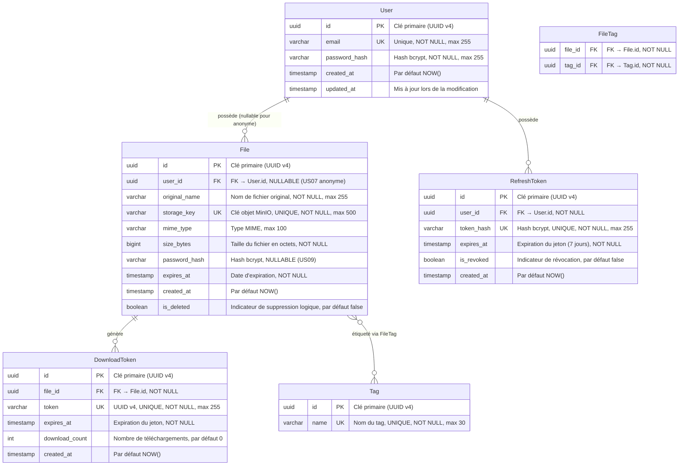

# DataShare — Schéma de base de données (MCD)

## Diagramme Entité-Relation

```mermaid
erDiagram
    User {
        uuid id PK "Clé primaire (UUID v4)"
        varchar email UK "Unique, NOT NULL, max 255"
        varchar password_hash "Hash bcrypt, NOT NULL, max 255"
        timestamp created_at "Par défaut NOW()"
        timestamp updated_at "Mis à jour lors de la modification"
    }

    File {
        uuid id PK "Clé primaire (UUID v4)"
        uuid user_id FK "FK → User.id, NULLABLE (US07 anonyme)"
        varchar original_name "Nom de fichier original, NOT NULL, max 255"
        varchar storage_key UK "Clé objet MinIO, UNIQUE, NOT NULL, max 500"
        varchar mime_type "Type MIME, max 100"
        bigint size_bytes "Taille du fichier en octets, NOT NULL"
        varchar password_hash "Hash bcrypt, NULLABLE (US09)"
        timestamp expires_at "Date d'expiration, NOT NULL"
        timestamp created_at "Par défaut NOW()"
        boolean is_deleted "Indicateur de suppression logique, par défaut false"
    }

    DownloadToken {
        uuid id PK "Clé primaire (UUID v4)"
        uuid file_id FK "FK → File.id, NOT NULL"
        varchar token UK "UUID v4, UNIQUE, NOT NULL, max 255"
        timestamp expires_at "Expiration du jeton, NOT NULL"
        int download_count "Nombre de téléchargements, par défaut 0"
        timestamp created_at "Par défaut NOW()"
    }

    RefreshToken {
        uuid id PK "Clé primaire (UUID v4)"
        uuid user_id FK "FK → User.id, NOT NULL"
        varchar token_hash UK "Hash bcrypt, UNIQUE, NOT NULL, max 255"
        timestamp expires_at "Expiration du jeton (7 jours), NOT NULL"
        boolean is_revoked "Indicateur de révocation, par défaut false"
        timestamp created_at "Par défaut NOW()"
    }

    Tag {
        uuid id PK "Clé primaire (UUID v4)"
        varchar name UK "Nom du tag, UNIQUE, NOT NULL, max 30"
    }

    FileTag {
        uuid file_id FK "FK → File.id, NOT NULL"
        uuid tag_id FK "FK → Tag.id, NOT NULL"
    }

    User ||--o{ File : "possède (nullable pour anonyme)"
    User ||--o{ RefreshToken : "possède"
    File ||--o{ DownloadToken : "génère"
    File }o--o{ Tag : "étiqueté via FileTag"
```

## Détails des entités

### User (US03, US04)

Utilisateurs inscrits pouvant uploader et gérer des fichiers.

| Colonne | Type | Contraintes | Description |
|--------|------|-------------|-------------|
| `id` | UUID | PK, par défaut `gen_random_uuid()` | Identifiant unique de l'utilisateur |
| `email` | VARCHAR(255) | UNIQUE, NOT NULL | Email de l'utilisateur (identifiant de connexion) |
| `password_hash` | VARCHAR(255) | NOT NULL | Hash bcrypt (salt rounds = 12) |
| `created_at` | TIMESTAMP | NOT NULL, par défaut `NOW()` | Date d'inscription |
| `updated_at` | TIMESTAMP | NOT NULL, par défaut `NOW()` | Dernière mise à jour du profil |

**Index** : `UNIQUE(email)`

---

### File (US01, US06, US07, US09, US10)

Métadonnées des fichiers uploadés. Le fichier réel est stocké dans MinIO.

| Colonne | Type | Contraintes | Description |
|--------|------|-------------|-------------|
| `id` | UUID | PK, par défaut `gen_random_uuid()` | Identifiant unique du fichier |
| `user_id` | UUID | FK → User.id, **NULLABLE** | Propriétaire (NULL = upload anonyme, US07) |
| `original_name` | VARCHAR(255) | NOT NULL | Nom de fichier original du client |
| `storage_key` | VARCHAR(500) | UNIQUE, NOT NULL | Clé objet MinIO (`{uuid}/{filename}`) |
| `mime_type` | VARCHAR(100) | NULLABLE | Type MIME (ex. : `application/pdf`) |
| `size_bytes` | BIGINT | NOT NULL | Taille du fichier en octets (max 1 Go = 1073741824) |
| `password_hash` | VARCHAR(255) | NULLABLE | Hash bcrypt du mot de passe du fichier (US09) |
| `expires_at` | TIMESTAMP | NOT NULL | Date d'expiration (1 à 7 jours après l'upload) |
| `created_at` | TIMESTAMP | NOT NULL, par défaut `NOW()` | Date d'upload |
| `is_deleted` | BOOLEAN | NOT NULL, par défaut `false` | Indicateur de suppression logique |

**Index** : `UNIQUE(storage_key)`, `INDEX(user_id)`, `INDEX(expires_at, is_deleted)`

**Règles métier** :
- `user_id` est NULL pour les uploads anonymes (US07)
- `password_hash` est NULL si aucun mot de passe n'est défini (US09)
- `expires_at` vaut par défaut `NOW() + 7 jours`, configurable de 1 à 7 jours
- `is_deleted = true` après suppression manuelle (US06) ou expiration automatique (US10)

---

### DownloadToken (US02)

Jetons uniques et non prédictibles pour les liens de téléchargement de fichiers.

| Colonne | Type | Contraintes | Description |
|--------|------|-------------|-------------|
| `id` | UUID | PK, par défaut `gen_random_uuid()` | Identifiant de l'enregistrement du jeton |
| `file_id` | UUID | FK → File.id, NOT NULL | Fichier associé |
| `token` | VARCHAR(255) | UNIQUE, NOT NULL | Jeton de téléchargement UUID v4 |
| `expires_at` | TIMESTAMP | NOT NULL | Expiration du jeton (correspond à l'expiration du fichier) |
| `download_count` | INT | NOT NULL, par défaut `0` | Nombre de téléchargements réussis |
| `created_at` | TIMESTAMP | NOT NULL, par défaut `NOW()` | Date de création du jeton |

**Index** : `UNIQUE(token)`, `INDEX(file_id)`

**Règles métier** :
- Le jeton est un `crypto.randomUUID()` — non séquentiel, non prédictible
- URL de téléchargement : `GET /api/download/{token}`
- Le jeton est invalidé lorsque `expires_at < NOW()` ou que le fichier parent est supprimé

---

### RefreshToken (US04 — Authentification)

Stocke les jetons de rafraîchissement hashés pour le renouvellement JWT.

| Colonne | Type | Contraintes | Description |
|--------|------|-------------|-------------|
| `id` | UUID | PK, par défaut `gen_random_uuid()` | Identifiant de l'enregistrement du jeton |
| `user_id` | UUID | FK → User.id, NOT NULL | Propriétaire du jeton |
| `token_hash` | VARCHAR(255) | UNIQUE, NOT NULL | Hash bcrypt du jeton de rafraîchissement |
| `expires_at` | TIMESTAMP | NOT NULL | Expiration (7 jours après la création) |
| `is_revoked` | BOOLEAN | NOT NULL, par défaut `false` | Mis à `true` lors de la déconnexion |
| `created_at` | TIMESTAMP | NOT NULL, par défaut `NOW()` | Date de création du jeton |

**Index** : `UNIQUE(token_hash)`, `INDEX(user_id)`

**Règles métier** :
- Le jeton de rafraîchissement est envoyé en cookie HttpOnly (jamais dans le corps de la réponse)
- À la déconnexion : `is_revoked = true` (non supprimé, pour la piste d'audit)
- Au rafraîchissement : l'ancien jeton est révoqué, un nouveau jeton est émis

---

### Tag (US08)

Tags pour l'organisation des fichiers.

| Colonne | Type | Contraintes | Description |
|--------|------|-------------|-------------|
| `id` | UUID | PK, par défaut `gen_random_uuid()` | Identifiant du tag |
| `name` | VARCHAR(30) | UNIQUE, NOT NULL | Nom du tag (texte libre, max 30 caractères) |

**Index** : `UNIQUE(name)`

---

### FileTag (US08 — Table de jointure)

Relation plusieurs-à-plusieurs entre File et Tag.

| Colonne | Type | Contraintes | Description |
|--------|------|-------------|-------------|
| `file_id` | UUID | FK → File.id, NOT NULL | Fichier associé |
| `tag_id` | UUID | FK → Tag.id, NOT NULL | Tag associé |

**Clé primaire** : `(file_id, tag_id)` — composite

**Règles métier** :
- Pas de tags dupliqués par fichier (garanti par la clé primaire composite)
- Suppression en cascade : lorsqu'un fichier est supprimé, les lignes FileTag associées sont supprimées
