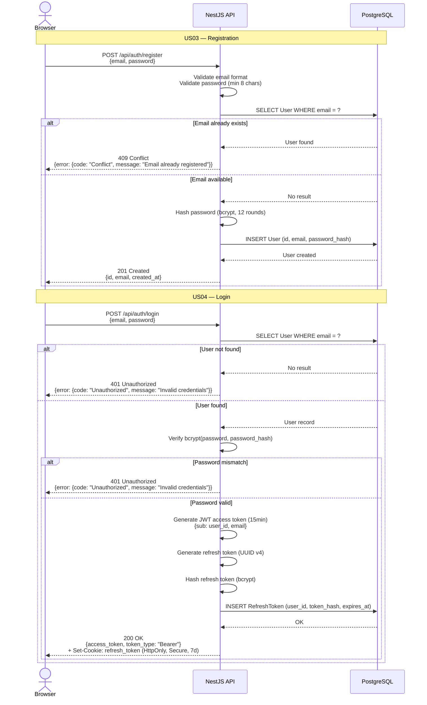
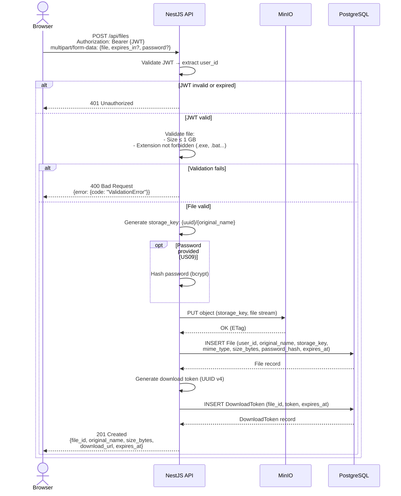
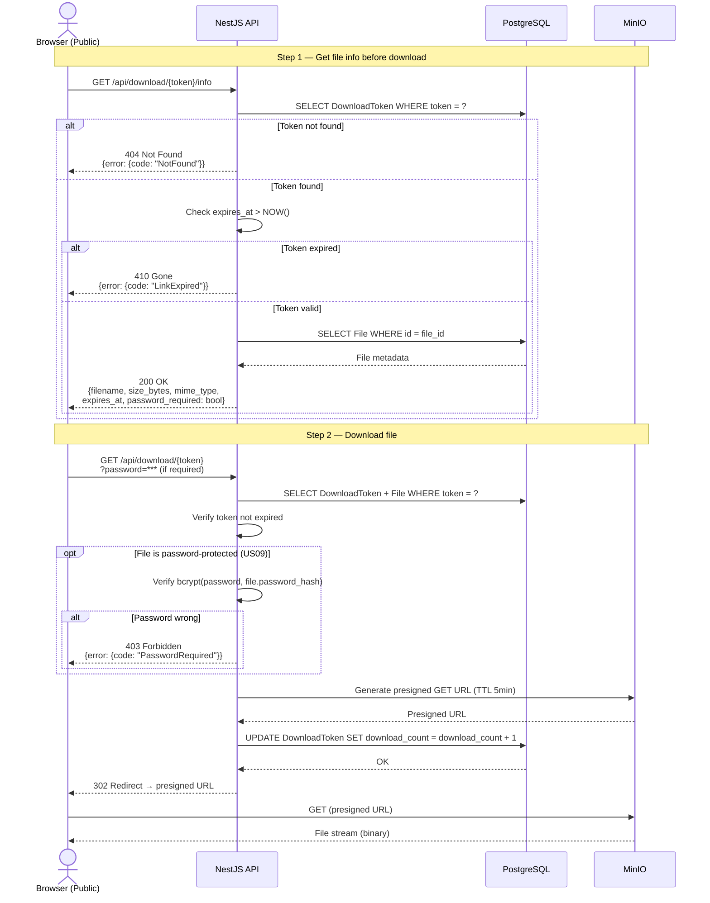
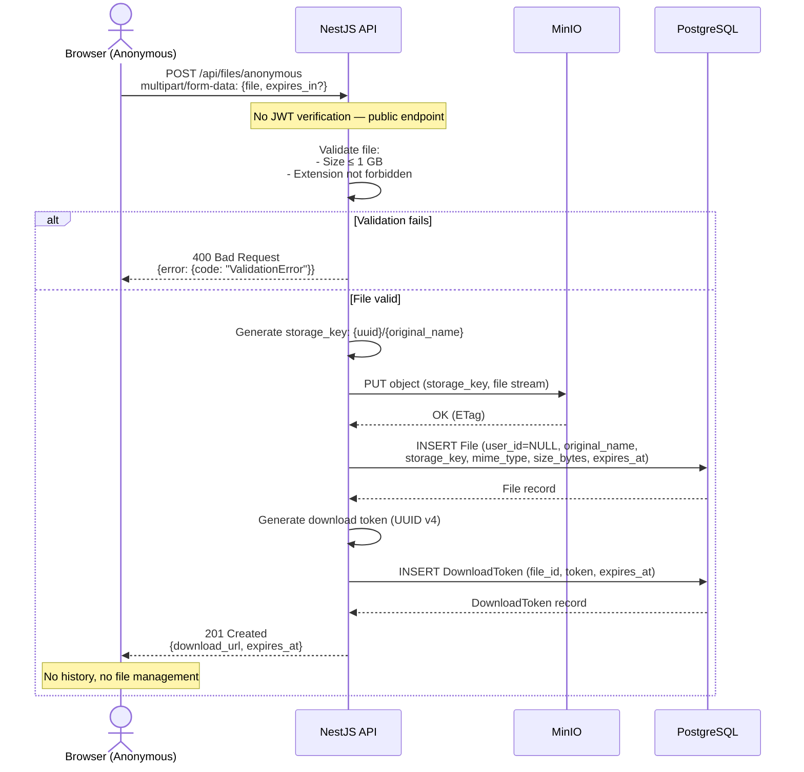
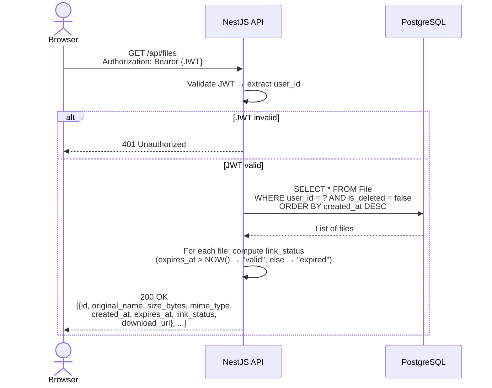
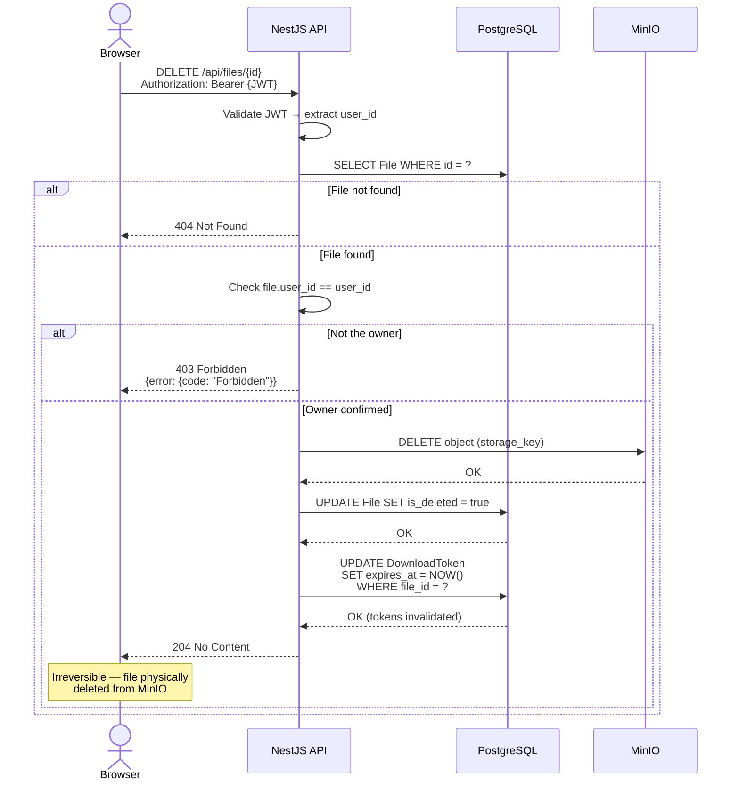
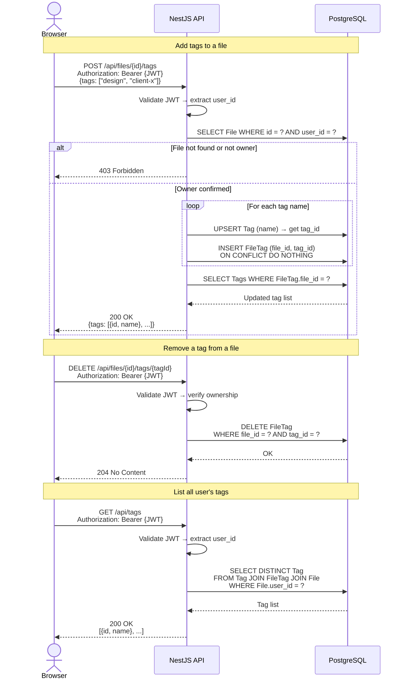
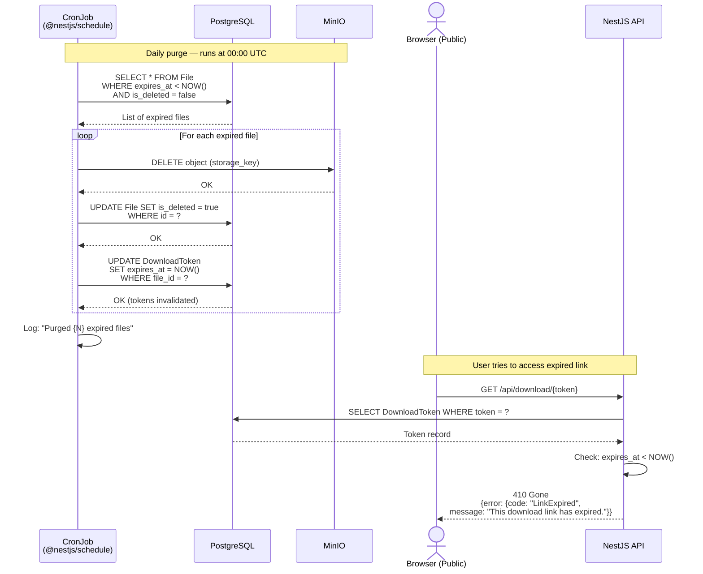

# DataShare — Sequence Diagrams

## Flux A — Registration + Login (US03 + US04)

---

## Flux B — File Upload with Account (US01 + US09)

---

## Flux C — Download via Link (US02)

---

## Flux D — Anonymous Upload (US07)

---

## Flux E — File History (US05)

---

## Flux F — File Deletion (US06)

---

## Flux G — Tag Management (US08)

---

## Flux H — Auto-Expiration (US10)

