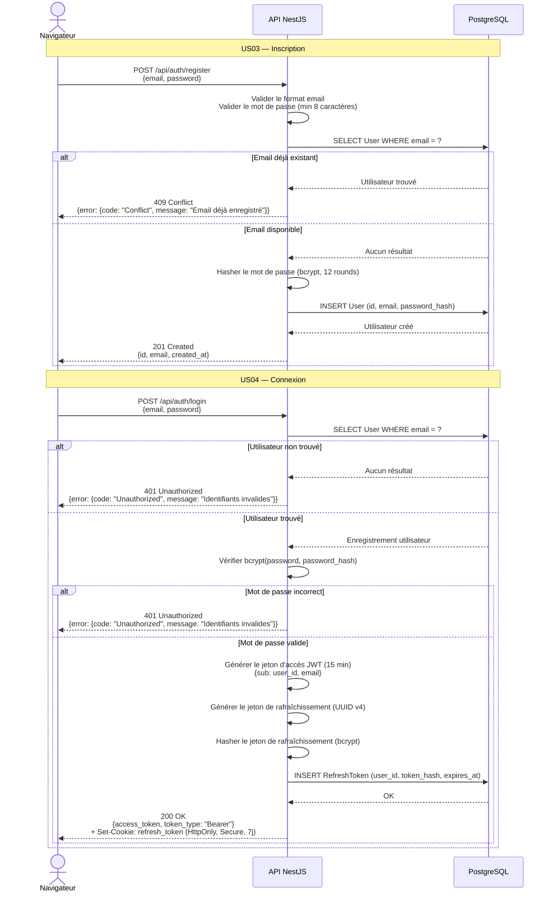
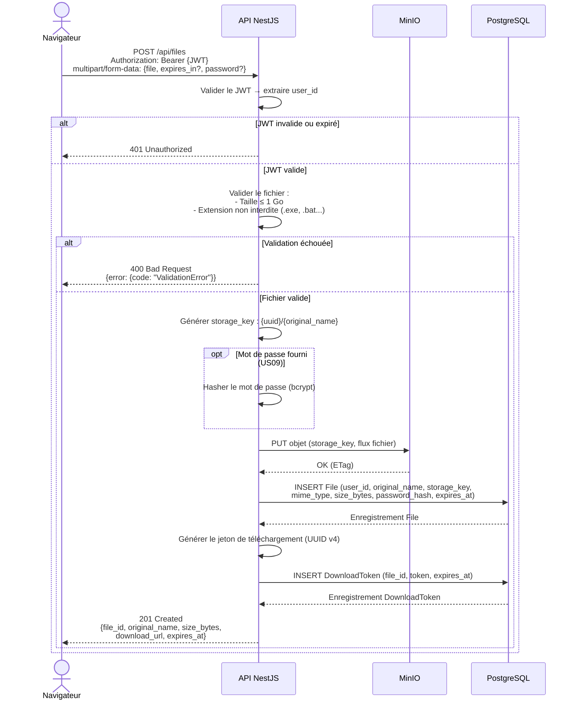
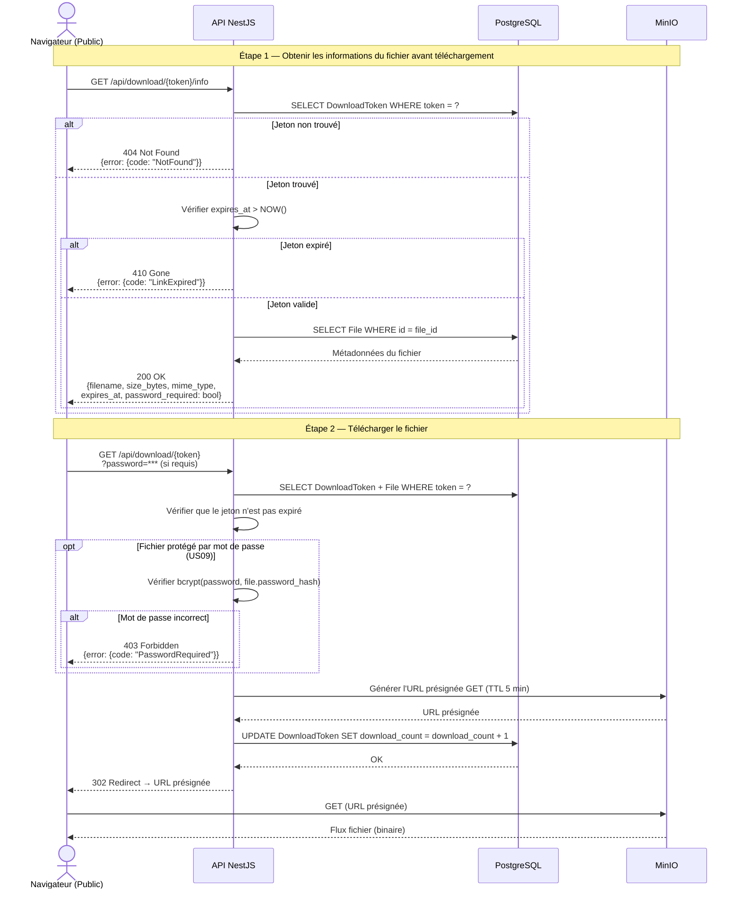
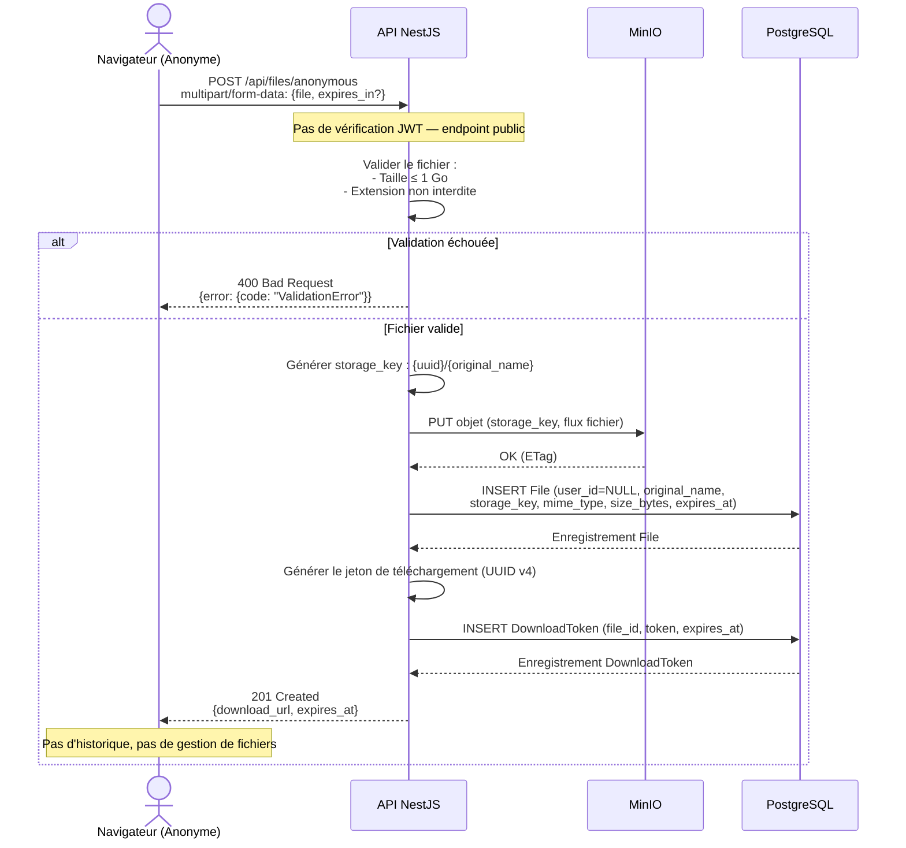
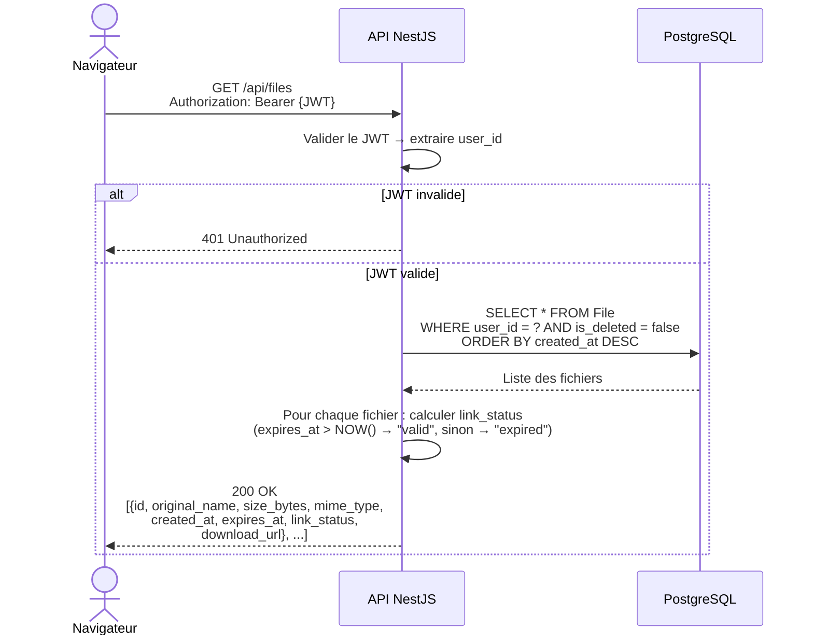
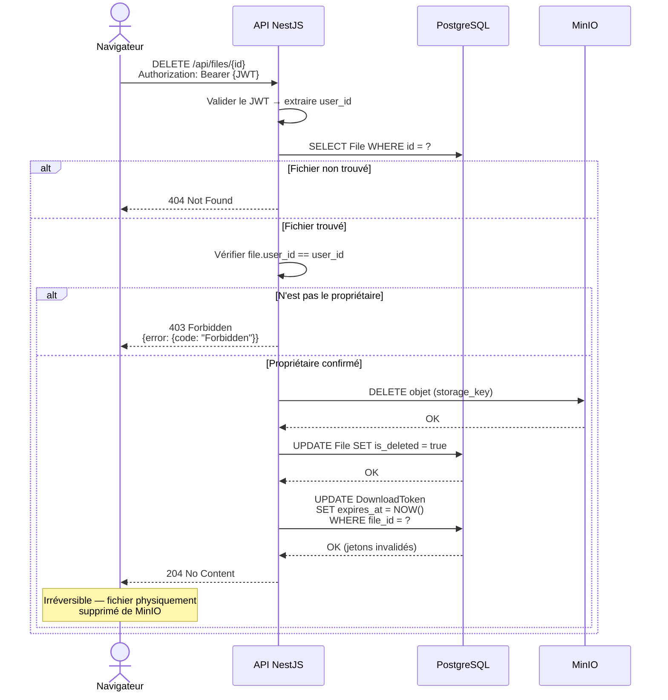
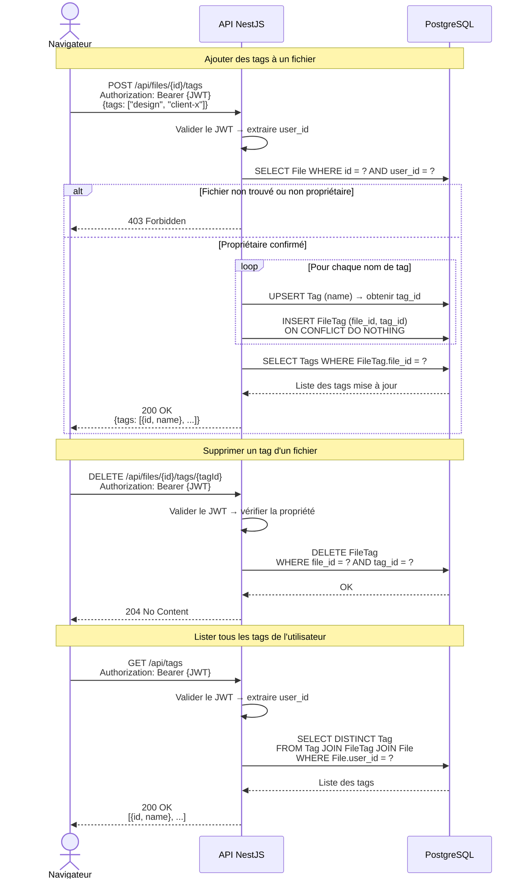
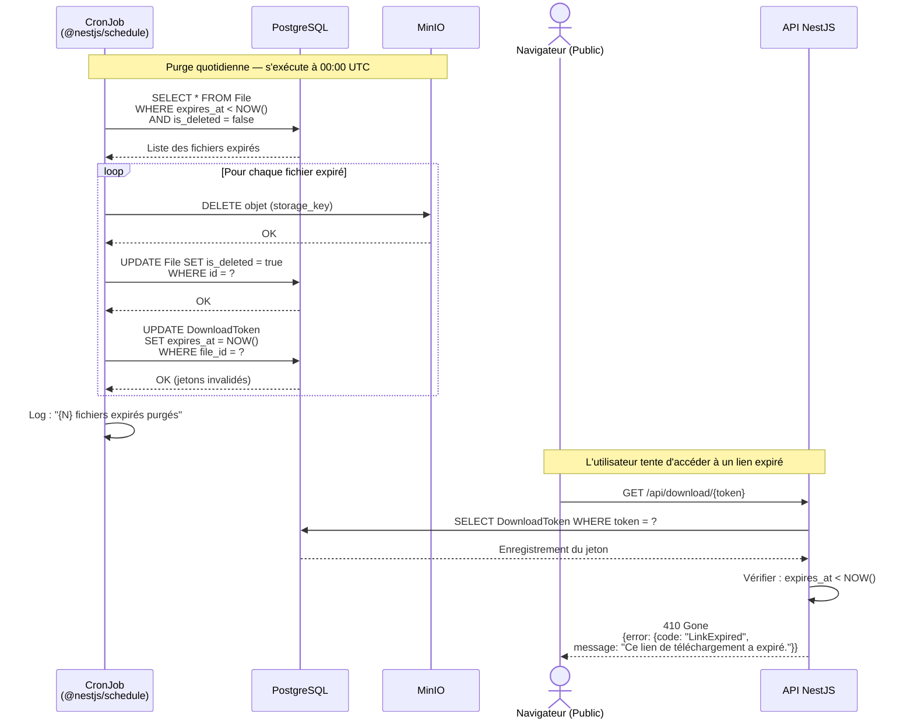

# DataShare — Diagrammes de séquence

## Flux A — Inscription + Connexion (US03 + US04)

```mermaid
sequenceDiagram
    actor User as Navigateur
    participant API as API NestJS
    participant DB as PostgreSQL

    Note over User, DB: US03 — Inscription
    User->>API: POST /api/auth/register<br/>{email, password}
    API->>API: Valider le format email<br/>Valider le mot de passe (min 8 caractères)
    API->>DB: SELECT User WHERE email = ?
    alt Email déjà existant
        DB-->>API: Utilisateur trouvé
        API-->>User: 409 Conflict<br/>{error: {code: "Conflict", message: "Email déjà enregistré"}}
    else Email disponible
        DB-->>API: Aucun résultat
        API->>API: Hasher le mot de passe (bcrypt, 12 rounds)
        API->>DB: INSERT User (id, email, password_hash)
        DB-->>API: Utilisateur créé
        API-->>User: 201 Created<br/>{id, email, created_at}
    end

    Note over User, DB: US04 — Connexion
    User->>API: POST /api/auth/login<br/>{email, password}
    API->>DB: SELECT User WHERE email = ?
    alt Utilisateur non trouvé
        DB-->>API: Aucun résultat
        API-->>User: 401 Unauthorized<br/>{error: {code: "Unauthorized", message: "Identifiants invalides"}}
    else Utilisateur trouvé
        DB-->>API: Enregistrement utilisateur
        API->>API: Vérifier bcrypt(password, password_hash)
        alt Mot de passe incorrect
            API-->>User: 401 Unauthorized<br/>{error: {code: "Unauthorized", message: "Identifiants invalides"}}
        else Mot de passe valide
            API->>API: Générer le jeton d'accès JWT (15 min)<br/>{sub: user_id, email}
            API->>API: Générer le jeton de rafraîchissement (UUID v4)
            API->>API: Hasher le jeton de rafraîchissement (bcrypt)
            API->>DB: INSERT RefreshToken (user_id, token_hash, expires_at)
            DB-->>API: OK
            API-->>User: 200 OK<br/>{access_token, token_type: "Bearer"}<br/>+ Set-Cookie: refresh_token (HttpOnly, Secure, 7j)
        end
    end
```

---

## Flux B — Upload de fichier avec compte (US01 + US09)

```mermaid
sequenceDiagram
    actor User as Navigateur
    participant API as API NestJS
    participant S3 as MinIO
    participant DB as PostgreSQL

    User->>API: POST /api/files<br/>Authorization: Bearer {JWT}<br/>multipart/form-data: {file, expires_in?, password?}
    API->>API: Valider le JWT → extraire user_id
    alt JWT invalide ou expiré
        API-->>User: 401 Unauthorized
    else JWT valide
        API->>API: Valider le fichier :<br/>- Taille ≤ 1 Go<br/>- Extension non interdite (.exe, .bat...)
        alt Validation échouée
            API-->>User: 400 Bad Request<br/>{error: {code: "ValidationError"}}
        else Fichier valide
            API->>API: Générer storage_key : {uuid}/{original_name}
            opt Mot de passe fourni (US09)
                API->>API: Hasher le mot de passe (bcrypt)
            end
            API->>S3: PUT objet (storage_key, flux fichier)
            S3-->>API: OK (ETag)
            API->>DB: INSERT File (user_id, original_name, storage_key,<br/>mime_type, size_bytes, password_hash, expires_at)
            DB-->>API: Enregistrement File
            API->>API: Générer le jeton de téléchargement (UUID v4)
            API->>DB: INSERT DownloadToken (file_id, token, expires_at)
            DB-->>API: Enregistrement DownloadToken
            API-->>User: 201 Created<br/>{file_id, original_name, size_bytes,<br/>download_url, expires_at}
        end
    end
```

---

## Flux C — Téléchargement via lien (US02)

```mermaid
sequenceDiagram
    actor Client as Navigateur (Public)
    participant API as API NestJS
    participant DB as PostgreSQL
    participant S3 as MinIO

    Note over Client, S3: Étape 1 — Obtenir les informations du fichier avant téléchargement
    Client->>API: GET /api/download/{token}/info
    API->>DB: SELECT DownloadToken WHERE token = ?
    alt Jeton non trouvé
        API-->>Client: 404 Not Found<br/>{error: {code: "NotFound"}}
    else Jeton trouvé
        API->>API: Vérifier expires_at > NOW()
        alt Jeton expiré
            API-->>Client: 410 Gone<br/>{error: {code: "LinkExpired"}}
        else Jeton valide
            API->>DB: SELECT File WHERE id = file_id
            DB-->>API: Métadonnées du fichier
            API-->>Client: 200 OK<br/>{filename, size_bytes, mime_type,<br/>expires_at, password_required: bool}
        end
    end

    Note over Client, S3: Étape 2 — Télécharger le fichier
    Client->>API: GET /api/download/{token}<br/>?password=*** (si requis)
    API->>DB: SELECT DownloadToken + File WHERE token = ?
    API->>API: Vérifier que le jeton n'est pas expiré
    opt Fichier protégé par mot de passe (US09)
        API->>API: Vérifier bcrypt(password, file.password_hash)
        alt Mot de passe incorrect
            API-->>Client: 403 Forbidden<br/>{error: {code: "PasswordRequired"}}
        end
    end
    API->>S3: Générer l'URL présignée GET (TTL 5 min)
    S3-->>API: URL présignée
    API->>DB: UPDATE DownloadToken SET download_count = download_count + 1
    DB-->>API: OK
    API-->>Client: 302 Redirect → URL présignée
    Client->>S3: GET (URL présignée)
    S3-->>Client: Flux fichier (binaire)
```

---

## Flux D — Upload anonyme (US07)

```mermaid
sequenceDiagram
    actor User as Navigateur (Anonyme)
    participant API as API NestJS
    participant S3 as MinIO
    participant DB as PostgreSQL

    User->>API: POST /api/files/anonymous<br/>multipart/form-data: {file, expires_in?}
    Note over API: Pas de vérification JWT — endpoint public
    API->>API: Valider le fichier :<br/>- Taille ≤ 1 Go<br/>- Extension non interdite
    alt Validation échouée
        API-->>User: 400 Bad Request<br/>{error: {code: "ValidationError"}}
    else Fichier valide
        API->>API: Générer storage_key : {uuid}/{original_name}
        API->>S3: PUT objet (storage_key, flux fichier)
        S3-->>API: OK (ETag)
        API->>DB: INSERT File (user_id=NULL, original_name,<br/>storage_key, mime_type, size_bytes, expires_at)
        DB-->>API: Enregistrement File
        API->>API: Générer le jeton de téléchargement (UUID v4)
        API->>DB: INSERT DownloadToken (file_id, token, expires_at)
        DB-->>API: Enregistrement DownloadToken
        API-->>User: 201 Created<br/>{download_url, expires_at}
        Note over User: Pas d'historique, pas de gestion de fichiers
    end
```

---

## Flux E — Historique des fichiers (US05)

```mermaid
sequenceDiagram
    actor User as Navigateur
    participant API as API NestJS
    participant DB as PostgreSQL

    User->>API: GET /api/files<br/>Authorization: Bearer {JWT}
    API->>API: Valider le JWT → extraire user_id
    alt JWT invalide
        API-->>User: 401 Unauthorized
    else JWT valide
        API->>DB: SELECT * FROM File<br/>WHERE user_id = ? AND is_deleted = false<br/>ORDER BY created_at DESC
        DB-->>API: Liste des fichiers
        API->>API: Pour chaque fichier : calculer link_status<br/>(expires_at > NOW() → "valid", sinon → "expired")
        API-->>User: 200 OK<br/>[{id, original_name, size_bytes, mime_type,<br/>created_at, expires_at, link_status,<br/>download_url}, ...]
    end
```

---

## Flux F — Suppression de fichier (US06)

```mermaid
sequenceDiagram
    actor User as Navigateur
    participant API as API NestJS
    participant DB as PostgreSQL
    participant S3 as MinIO

    User->>API: DELETE /api/files/{id}<br/>Authorization: Bearer {JWT}
    API->>API: Valider le JWT → extraire user_id
    API->>DB: SELECT File WHERE id = ?
    alt Fichier non trouvé
        API-->>User: 404 Not Found
    else Fichier trouvé
        API->>API: Vérifier file.user_id == user_id
        alt N'est pas le propriétaire
            API-->>User: 403 Forbidden<br/>{error: {code: "Forbidden"}}
        else Propriétaire confirmé
            API->>S3: DELETE objet (storage_key)
            S3-->>API: OK
            API->>DB: UPDATE File SET is_deleted = true
            DB-->>API: OK
            API->>DB: UPDATE DownloadToken<br/>SET expires_at = NOW()<br/>WHERE file_id = ?
            DB-->>API: OK (jetons invalidés)
            API-->>User: 204 No Content
            Note over User: Irréversible — fichier physiquement<br/>supprimé de MinIO
        end
    end
```

---

## Flux G — Gestion des tags (US08)

```mermaid
sequenceDiagram
    actor User as Navigateur
    participant API as API NestJS
    participant DB as PostgreSQL

    Note over User, DB: Ajouter des tags à un fichier
    User->>API: POST /api/files/{id}/tags<br/>Authorization: Bearer {JWT}<br/>{tags: ["design", "client-x"]}
    API->>API: Valider le JWT → extraire user_id
    API->>DB: SELECT File WHERE id = ? AND user_id = ?
    alt Fichier non trouvé ou non propriétaire
        API-->>User: 403 Forbidden
    else Propriétaire confirmé
        loop Pour chaque nom de tag
            API->>DB: UPSERT Tag (name) → obtenir tag_id
            API->>DB: INSERT FileTag (file_id, tag_id)<br/>ON CONFLICT DO NOTHING
        end
        API->>DB: SELECT Tags WHERE FileTag.file_id = ?
        DB-->>API: Liste des tags mise à jour
        API-->>User: 200 OK<br/>{tags: [{id, name}, ...]}
    end

    Note over User, DB: Supprimer un tag d'un fichier
    User->>API: DELETE /api/files/{id}/tags/{tagId}<br/>Authorization: Bearer {JWT}
    API->>API: Valider le JWT → vérifier la propriété
    API->>DB: DELETE FileTag<br/>WHERE file_id = ? AND tag_id = ?
    DB-->>API: OK
    API-->>User: 204 No Content

    Note over User, DB: Lister tous les tags de l'utilisateur
    User->>API: GET /api/tags<br/>Authorization: Bearer {JWT}
    API->>API: Valider le JWT → extraire user_id
    API->>DB: SELECT DISTINCT Tag<br/>FROM Tag JOIN FileTag JOIN File<br/>WHERE File.user_id = ?
    DB-->>API: Liste des tags
    API-->>User: 200 OK<br/>[{id, name}, ...]
```

---

## Flux H — Expiration automatique (US10)

```mermaid
sequenceDiagram
    participant Cron as CronJob<br/>(@nestjs/schedule)
    participant DB as PostgreSQL
    participant S3 as MinIO
    actor Client as Navigateur (Public)
    participant API as API NestJS

    Note over Cron, S3: Purge quotidienne — s'exécute à 00:00 UTC
    Cron->>DB: SELECT * FROM File<br/>WHERE expires_at < NOW()<br/>AND is_deleted = false
    DB-->>Cron: Liste des fichiers expirés

    loop Pour chaque fichier expiré
        Cron->>S3: DELETE objet (storage_key)
        S3-->>Cron: OK
        Cron->>DB: UPDATE File SET is_deleted = true<br/>WHERE id = ?
        DB-->>Cron: OK
        Cron->>DB: UPDATE DownloadToken<br/>SET expires_at = NOW()<br/>WHERE file_id = ?
        DB-->>Cron: OK (jetons invalidés)
    end
    Cron->>Cron: Log : "{N} fichiers expirés purgés"

    Note over Client, API: L'utilisateur tente d'accéder à un lien expiré
    Client->>API: GET /api/download/{token}
    API->>DB: SELECT DownloadToken WHERE token = ?
    DB-->>API: Enregistrement du jeton
    API->>API: Vérifier : expires_at < NOW()
    API-->>Client: 410 Gone<br/>{error: {code: "LinkExpired",<br/>message: "Ce lien de téléchargement a expiré."}}
```
