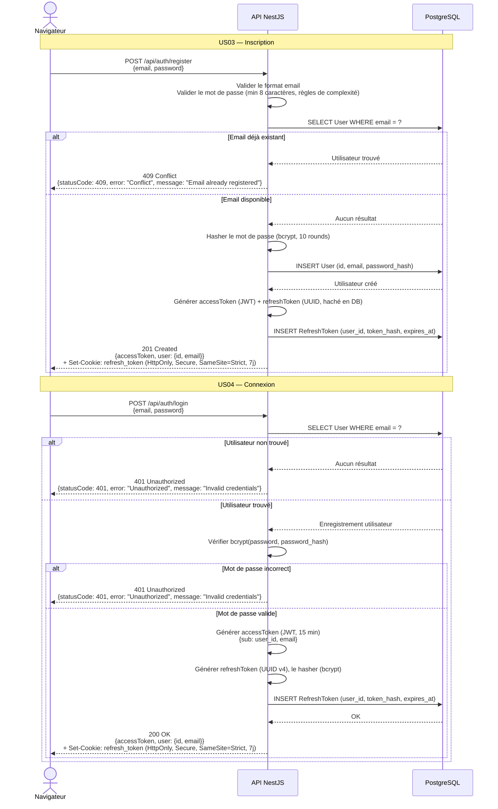
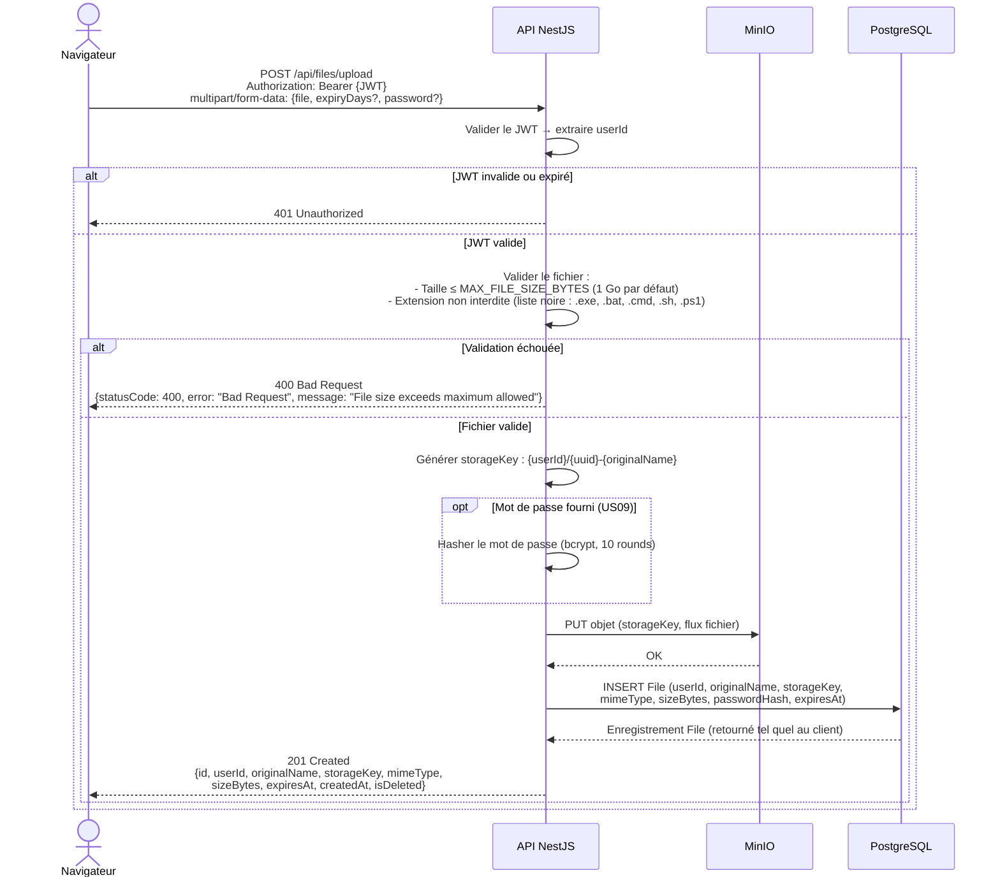
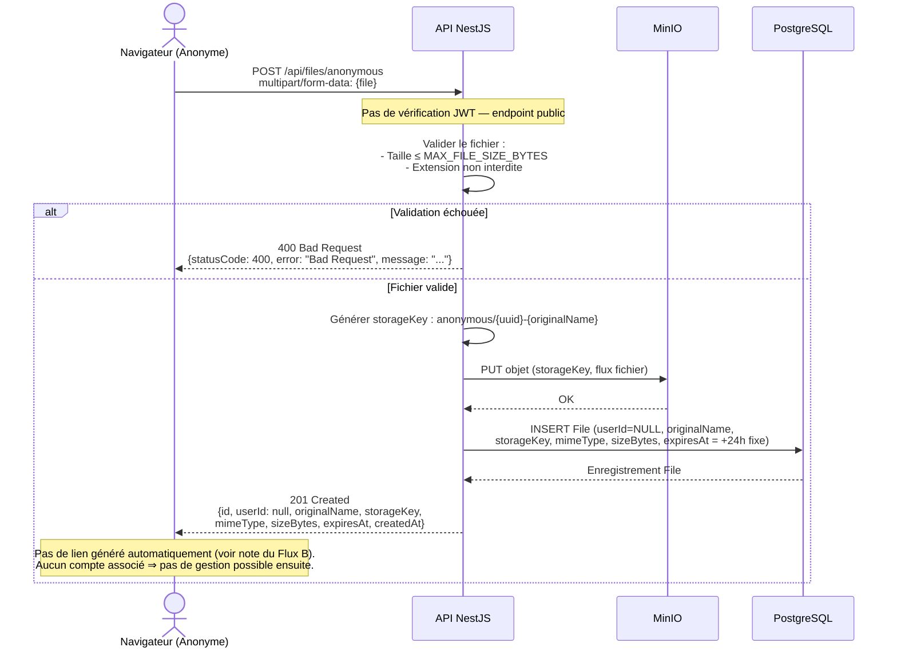
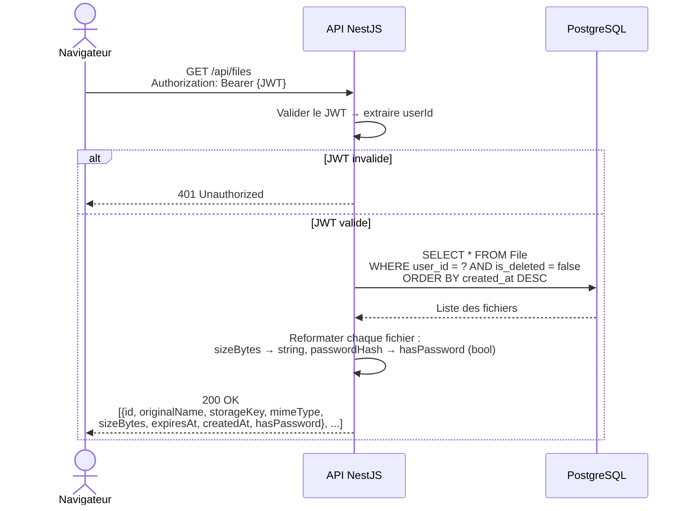
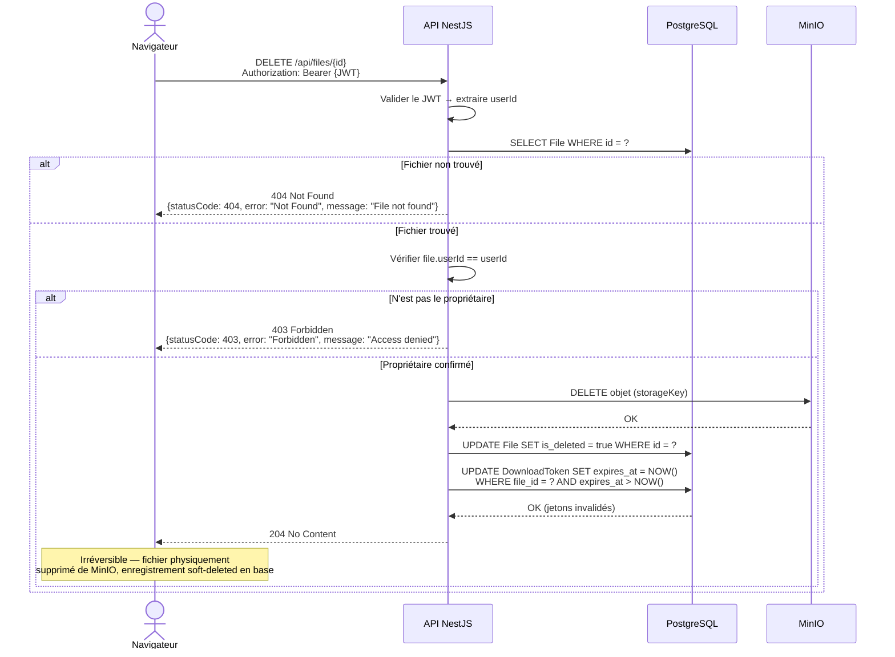
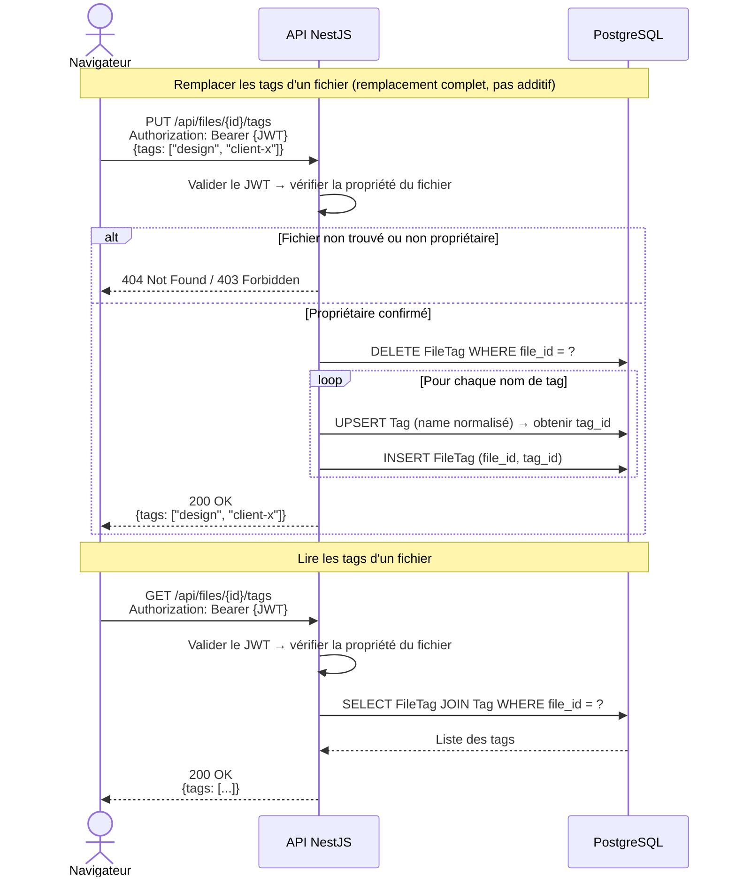
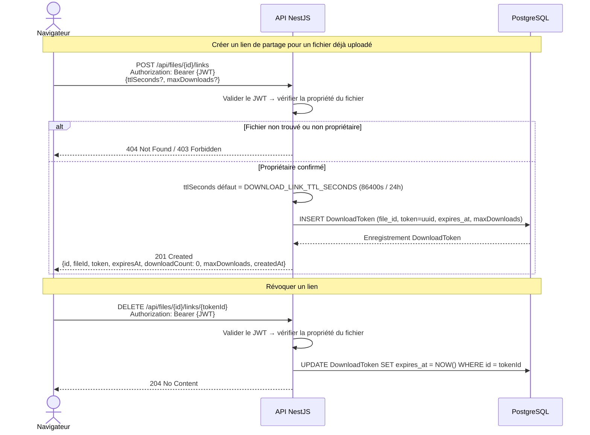
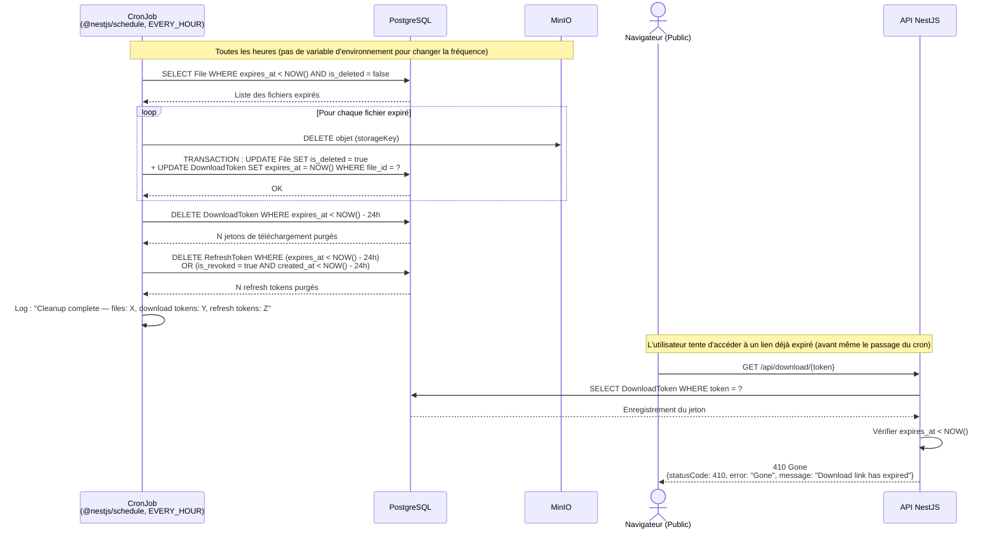

# DataShare — Diagrammes de séquence

> Ces diagrammes reflètent le comportement réel du code (`backend/src`), pas
> une intention de conception. Les corps d'erreur suivent le format par défaut
> de NestJS (`{statusCode, message, error}`) — aucun `ExceptionFilter` custom
> n'est enregistré dans le projet.

## Flux A — Inscription + Connexion (US03 + US04)

```mermaid
sequenceDiagram
    actor User as Navigateur
    participant API as API NestJS
    participant DB as PostgreSQL

    Note over User, DB: US03 — Inscription
    User->>API: POST /api/auth/register<br/>{email, password}
    API->>API: Valider le format email<br/>Valider le mot de passe (min 8 caractères, règles de complexité)
    API->>DB: SELECT User WHERE email = ?
    alt Email déjà existant
        DB-->>API: Utilisateur trouvé
        API-->>User: 409 Conflict<br/>{statusCode: 409, error: "Conflict", message: "Email already registered"}
    else Email disponible
        DB-->>API: Aucun résultat
        API->>API: Hasher le mot de passe (bcrypt, 10 rounds)
        API->>DB: INSERT User (id, email, password_hash)
        DB-->>API: Utilisateur créé
        API->>API: Générer accessToken (JWT) + refreshToken (UUID, haché en DB)
        API->>DB: INSERT RefreshToken (user_id, token_hash, expires_at)
        API-->>User: 201 Created<br/>{accessToken, user: {id, email}}<br/>+ Set-Cookie: refresh_token (HttpOnly, Secure, SameSite=Strict, 7j)
    end

    Note over User, DB: US04 — Connexion
    User->>API: POST /api/auth/login<br/>{email, password}
    API->>DB: SELECT User WHERE email = ?
    alt Utilisateur non trouvé
        DB-->>API: Aucun résultat
        API-->>User: 401 Unauthorized<br/>{statusCode: 401, error: "Unauthorized", message: "Invalid credentials"}
    else Utilisateur trouvé
        DB-->>API: Enregistrement utilisateur
        API->>API: Vérifier bcrypt(password, password_hash)
        alt Mot de passe incorrect
            API-->>User: 401 Unauthorized<br/>{statusCode: 401, error: "Unauthorized", message: "Invalid credentials"}
        else Mot de passe valide
            API->>API: Générer accessToken (JWT, 15 min)<br/>{sub: user_id, email}
            API->>API: Générer refreshToken (UUID v4), le hasher (bcrypt)
            API->>DB: INSERT RefreshToken (user_id, token_hash, expires_at)
            DB-->>API: OK
            API-->>User: 200 OK<br/>{accessToken, user: {id, email}}<br/>+ Set-Cookie: refresh_token (HttpOnly, Secure, SameSite=Strict, 7j)
        end
    end
```

---

## Flux B — Upload de fichier avec compte (US01)

```mermaid
sequenceDiagram
    actor User as Navigateur
    participant API as API NestJS
    participant S3 as MinIO
    participant DB as PostgreSQL

    User->>API: POST /api/files/upload<br/>Authorization: Bearer {JWT}<br/>multipart/form-data: {file, expiryDays?, password?}
    API->>API: Valider le JWT → extraire userId
    alt JWT invalide ou expiré
        API-->>User: 401 Unauthorized
    else JWT valide
        API->>API: Valider le fichier :<br/>- Taille ≤ MAX_FILE_SIZE_BYTES (1 Go par défaut)<br/>- Extension non interdite (liste noire : .exe, .bat, .cmd, .sh, .ps1)
        alt Validation échouée
            API-->>User: 400 Bad Request<br/>{statusCode: 400, error: "Bad Request", message: "File size exceeds maximum allowed"}
        else Fichier valide
            API->>API: Générer storageKey : {userId}/{uuid}-{originalName}
            opt Mot de passe fourni (US09)
                API->>API: Hasher le mot de passe (bcrypt, 10 rounds)
            end
            API->>S3: PUT objet (storageKey, flux fichier)
            S3-->>API: OK
            API->>DB: INSERT File (userId, originalName, storageKey,<br/>mimeType, sizeBytes, passwordHash, expiresAt)
            DB-->>API: Enregistrement File (retourné tel quel au client)
            API-->>User: 201 Created<br/>{id, userId, originalName, storageKey, mimeType,<br/>sizeBytes, expiresAt, createdAt, isDeleted}
        end
    end
```

> Aucun lien de partage n'est créé automatiquement à l'upload : c'est un appel
> séparé à `POST /api/files/{id}/links` (Flux G bis) qui génère un
> `DownloadToken`. C'est une différence volontaire avec une version antérieure
> du modèle de données (voir `DownloadToken` séparé de `File` dans le schéma
> Prisma) — ce diagramme, comme `openapi.yaml`, décrivait auparavant l'ancien
> flux en une étape.

---

## Flux C — Téléchargement via lien (US02)

```mermaid
sequenceDiagram
    actor Client as Navigateur (Public)
    participant API as API NestJS
    participant DB as PostgreSQL
    participant S3 as MinIO

    Note over Client, S3: Étape 1 — Obtenir les informations du fichier avant téléchargement
    Client->>API: GET /api/download/{token}/info
    API->>DB: SELECT DownloadToken WHERE token = ? (+ File associé)
    alt Jeton non trouvé
        API-->>Client: 404 Not Found<br/>{statusCode: 404, error: "Not Found", message: "Download link not found"}
    else Jeton trouvé
        API->>API: Vérifier expiresAt > NOW()
        alt Jeton expiré
            API-->>Client: 410 Gone<br/>{statusCode: 410, error: "Gone", message: "Download link has expired"}
        else Jeton valide
            API-->>Client: 200 OK<br/>{originalName, mimeType, sizeBytes (string), hasPassword}
        end
    end

    Note over Client, S3: Étape 2 — Télécharger le fichier (le backend proxie MinIO, pas de redirection)
    Client->>API: GET /api/download/{token}<br/>?password=*** (si requis)
    API->>DB: SELECT DownloadToken + File WHERE token = ?
    API->>API: Vérifier expiresAt > NOW() et fichier non supprimé
    API->>API: Vérifier maxDownloads > 0 ⇒ downloadCount < maxDownloads
    alt Jeton expiré ou limite de téléchargements atteinte
        API-->>Client: 410 Gone<br/>{statusCode: 410, error: "Gone", message: "Download limit reached"}
    else Jeton utilisable
        opt Fichier protégé par mot de passe (US09)
            API->>API: Vérifier bcrypt(password, file.passwordHash)
            alt Mot de passe manquant ou incorrect
                API-->>Client: 401 Unauthorized<br/>{statusCode: 401, error: "Unauthorized", message: "Password required" | "Invalid password"}
            end
        end
        API->>DB: UPDATE DownloadToken SET downloadCount = downloadCount + 1
        Note over API, DB: Non atomique : lecture puis écriture séparées (course possible sous forte concurrence)
        DB-->>API: OK
        API->>S3: GET objet (storageKey) — flux
        S3-->>API: Flux binaire
        API-->>Client: 200 OK<br/>Content-Disposition: attachment; filename="..."<br/>(fichier streamé directement, pas de redirection)
    end
```

---

## Flux D — Upload anonyme (US07)

```mermaid
sequenceDiagram
    actor User as Navigateur (Anonyme)
    participant API as API NestJS
    participant S3 as MinIO
    participant DB as PostgreSQL

    User->>API: POST /api/files/anonymous<br/>multipart/form-data: {file}
    Note over API: Pas de vérification JWT — endpoint public
    API->>API: Valider le fichier :<br/>- Taille ≤ MAX_FILE_SIZE_BYTES<br/>- Extension non interdite
    alt Validation échouée
        API-->>User: 400 Bad Request<br/>{statusCode: 400, error: "Bad Request", message: "..."}
    else Fichier valide
        API->>API: Générer storageKey : anonymous/{uuid}-{originalName}
        API->>S3: PUT objet (storageKey, flux fichier)
        S3-->>API: OK
        API->>DB: INSERT File (userId=NULL, originalName,<br/>storageKey, mimeType, sizeBytes, expiresAt = +24h fixe)
        DB-->>API: Enregistrement File
        API-->>User: 201 Created<br/>{id, userId: null, originalName, storageKey,<br/>mimeType, sizeBytes, expiresAt, createdAt}
        Note over User: Pas de lien généré automatiquement (voir note du Flux B).<br/>Aucun compte associé ⇒ pas de gestion possible ensuite.
    end
```

---

## Flux E — Liste des fichiers de l'utilisateur (US05)

```mermaid
sequenceDiagram
    actor User as Navigateur
    participant API as API NestJS
    participant DB as PostgreSQL

    User->>API: GET /api/files<br/>Authorization: Bearer {JWT}
    API->>API: Valider le JWT → extraire userId
    alt JWT invalide
        API-->>User: 401 Unauthorized
    else JWT valide
        API->>DB: SELECT * FROM File<br/>WHERE user_id = ? AND is_deleted = false<br/>ORDER BY created_at DESC
        DB-->>API: Liste des fichiers
        API->>API: Reformater chaque fichier :<br/>sizeBytes → string, passwordHash → hasPassword (bool)
        API-->>User: 200 OK<br/>[{id, originalName, storageKey, mimeType,<br/>sizeBytes, expiresAt, createdAt, hasPassword}, ...]
    end
```

> Aucune pagination, aucun tri et aucun filtrage par tag ne sont implémentés
> sur cet endpoint aujourd'hui : `findAllByUser()` renvoie systématiquement la
> totalité des fichiers non supprimés. Un DTO `ListFilesDto` (page, limit,
> sortBy, order) existe dans `backend/src/files/dto/list-files.dto.ts` mais
> n'est branché ni sur le contrôleur ni sur le service — c'est du code mort.

---

## Flux F — Suppression de fichier (US06)

```mermaid
sequenceDiagram
    actor User as Navigateur
    participant API as API NestJS
    participant DB as PostgreSQL
    participant S3 as MinIO

    User->>API: DELETE /api/files/{id}<br/>Authorization: Bearer {JWT}
    API->>API: Valider le JWT → extraire userId
    API->>DB: SELECT File WHERE id = ?
    alt Fichier non trouvé
        API-->>User: 404 Not Found<br/>{statusCode: 404, error: "Not Found", message: "File not found"}
    else Fichier trouvé
        API->>API: Vérifier file.userId == userId
        alt N'est pas le propriétaire
            API-->>User: 403 Forbidden<br/>{statusCode: 403, error: "Forbidden", message: "Access denied"}
        else Propriétaire confirmé
            API->>S3: DELETE objet (storageKey)
            S3-->>API: OK
            API->>DB: UPDATE File SET is_deleted = true WHERE id = ?
            API->>DB: UPDATE DownloadToken SET expires_at = NOW()<br/>WHERE file_id = ? AND expires_at > NOW()
            DB-->>API: OK (jetons invalidés)
            API-->>User: 204 No Content
            Note over User: Irréversible — fichier physiquement<br/>supprimé de MinIO, enregistrement soft-deleted en base
        end
    end
```

---

## Flux G — Gestion des tags (US08)

```mermaid
sequenceDiagram
    actor User as Navigateur
    participant API as API NestJS
    participant DB as PostgreSQL

    Note over User, DB: Remplacer les tags d'un fichier (remplacement complet, pas additif)
    User->>API: PUT /api/files/{id}/tags<br/>Authorization: Bearer {JWT}<br/>{tags: ["design", "client-x"]}
    API->>API: Valider le JWT → vérifier la propriété du fichier
    alt Fichier non trouvé ou non propriétaire
        API-->>User: 404 Not Found / 403 Forbidden
    else Propriétaire confirmé
        API->>DB: DELETE FileTag WHERE file_id = ?
        loop Pour chaque nom de tag
            API->>DB: UPSERT Tag (name normalisé) → obtenir tag_id
            API->>DB: INSERT FileTag (file_id, tag_id)
        end
        API-->>User: 200 OK<br/>{tags: ["design", "client-x"]}
    end

    Note over User, DB: Lire les tags d'un fichier
    User->>API: GET /api/files/{id}/tags<br/>Authorization: Bearer {JWT}
    API->>API: Valider le JWT → vérifier la propriété du fichier
    API->>DB: SELECT FileTag JOIN Tag WHERE file_id = ?
    DB-->>API: Liste des tags
    API-->>User: 200 OK<br/>{tags: [...]}
```

> Il n'existe **aucun** endpoint pour retirer un seul tag (`DELETE .../tags/{tagId}`)
> ni pour lister l'ensemble des tags d'un utilisateur tous fichiers confondus
> (`GET /api/tags`) : ces deux routes figuraient dans une version antérieure
> de ce diagramme et de `openapi.yaml` mais ne sont implémentées nulle part
> dans `files.controller.ts`. Pour retirer un tag, il faut renvoyer la liste
> complète des tags restants via `PUT /api/files/{id}/tags`.

---

## Flux G bis — Liens de téléchargement partageables (US01, étape séparée)

```mermaid
sequenceDiagram
    actor User as Navigateur
    participant API as API NestJS
    participant DB as PostgreSQL

    Note over User, DB: Créer un lien de partage pour un fichier déjà uploadé
    User->>API: POST /api/files/{id}/links<br/>Authorization: Bearer {JWT}<br/>{ttlSeconds?, maxDownloads?}
    API->>API: Valider le JWT → vérifier la propriété du fichier
    alt Fichier non trouvé ou non propriétaire
        API-->>User: 404 Not Found / 403 Forbidden
    else Propriétaire confirmé
        API->>API: ttlSeconds défaut = DOWNLOAD_LINK_TTL_SECONDS (86400s / 24h)
        API->>DB: INSERT DownloadToken (file_id, token=uuid, expires_at, maxDownloads)
        DB-->>API: Enregistrement DownloadToken
        API-->>User: 201 Created<br/>{id, fileId, token, expiresAt, downloadCount: 0, maxDownloads, createdAt}
    end

    Note over User, DB: Révoquer un lien
    User->>API: DELETE /api/files/{id}/links/{tokenId}<br/>Authorization: Bearer {JWT}
    API->>API: Valider le JWT → vérifier la propriété du fichier
    API->>DB: UPDATE DownloadToken SET expires_at = NOW() WHERE id = tokenId
    API-->>User: 204 No Content
```

---

## Flux H — Nettoyage automatique planifié

```mermaid
sequenceDiagram
    participant Cron as CronJob<br/>(@nestjs/schedule, EVERY_HOUR)
    participant DB as PostgreSQL
    participant S3 as MinIO
    actor Client as Navigateur (Public)
    participant API as API NestJS

    Note over Cron, S3: Toutes les heures (pas de variable d'environnement pour changer la fréquence)
    Cron->>DB: SELECT File WHERE expires_at < NOW() AND is_deleted = false
    DB-->>Cron: Liste des fichiers expirés
    loop Pour chaque fichier expiré
        Cron->>S3: DELETE objet (storageKey)
        Cron->>DB: TRANSACTION : UPDATE File SET is_deleted = true<br/>+ UPDATE DownloadToken SET expires_at = NOW() WHERE file_id = ?
        DB-->>Cron: OK
    end

    Cron->>DB: DELETE DownloadToken WHERE expires_at < NOW() - 24h
    DB-->>Cron: N jetons de téléchargement purgés

    Cron->>DB: DELETE RefreshToken WHERE (expires_at < NOW() - 24h)<br/>OR (is_revoked = true AND created_at < NOW() - 24h)
    DB-->>Cron: N refresh tokens purgés

    Cron->>Cron: Log : "Cleanup complete — files: X, download tokens: Y, refresh tokens: Z"

    Note over Client, API: L'utilisateur tente d'accéder à un lien déjà expiré (avant même le passage du cron)
    Client->>API: GET /api/download/{token}
    API->>DB: SELECT DownloadToken WHERE token = ?
    DB-->>API: Enregistrement du jeton
    API->>API: Vérifier expires_at < NOW()
    API-->>Client: 410 Gone<br/>{statusCode: 410, error: "Gone", message: "Download link has expired"}
```

> Il n'existe aucun moyen de déclencher ce nettoyage manuellement ni d'en
> configurer la fréquence via une variable d'environnement (voir
> `docs/maintenance/MAINTENANCE.md`) — la fréquence `EVERY_HOUR` est fixée en
> dur dans `cleanup.service.ts`.
