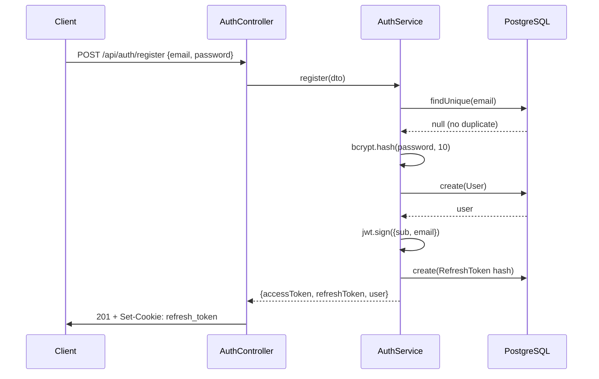
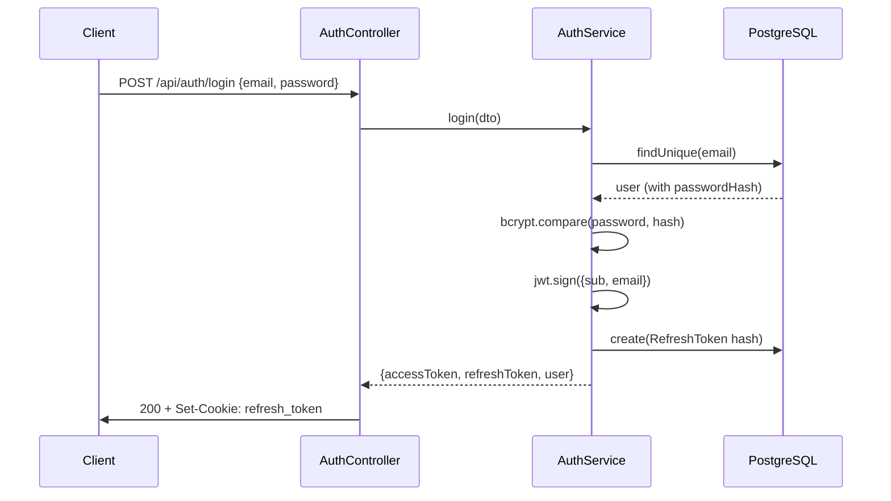

# Authentication Module — US03 & US04

## Overview

The AuthModule handles user registration (US03) and authentication (US04) for the DataShare platform. It implements a JWT-based authentication strategy with refresh token rotation.

## Architecture

```
backend/src/auth/
├── auth.module.ts          ← NestJS module declaration
├── auth.controller.ts      ← 4 REST endpoints
├── auth.service.ts         ← Business logic (register, login, logout, refresh)
├── dto/
│   ├── register.dto.ts     ← Input validation for registration
│   └── login.dto.ts        ← Input validation for login
└── guards/
    └── jwt.guard.ts        ← Reusable guard for protected routes
```

## API Routes

| Method | Path | Auth | Description |
|--------|------|------|-------------|
| `POST` | `/api/auth/register` | No | Create a new account |
| `POST` | `/api/auth/login` | No | Authenticate, get tokens |
| `POST` | `/api/auth/logout` | Yes (JWT) | Revoke refresh token |
| `POST` | `/api/auth/refresh` | No (cookie) | Renew access token |

## Token Strategy

### Access Token (JWT)
- **Algorithm**: HS256
- **Payload**: `{ sub: user_id, email: user_email }`
- **TTL**: 15 minutes (configurable via `JWT_EXPIRES_IN`)
- **Transport**: `Authorization: Bearer <token>` header

### Refresh Token
- **Format**: UUID v4 (raw value)
- **Storage**: bcrypt hash in `refresh_tokens` table
- **TTL**: 7 days (configurable via `REFRESH_TOKEN_EXPIRES_IN`)
- **Transport**: HttpOnly cookie (`refresh_token`)
- **Cookie flags**: `HttpOnly`, `Secure`, `SameSite=Strict`, path `/api/auth`
- **Rotation**: Each refresh invalidates the old token and issues a new one

### Password Hashing
- **Algorithm**: bcrypt
- **Salt rounds**: 10
- **Minimum length**: 8 characters (validated in DTO)

## Sequence Diagrams

### Registration (US03)



### Login (US04)



## JwtGuard

Reusable guard for any protected route in future modules (Files, Download, Tags):

```typescript
@UseGuards(JwtGuard)
@Get('protected-route')
async handler(@Req() req) {
  // req.user = { sub: 'user-id', email: '...' }
}
```

The guard:
1. Extracts `Bearer <token>` from `Authorization` header
2. Verifies JWT signature + expiration using `JWT_SECRET`
3. Attaches decoded payload to `request.user`
4. Throws `401 Unauthorized` if token is missing/invalid/expired

## Error Responses

| Code | Error | When |
|------|-------|------|
| 201 | — | Account created successfully |
| 200 | — | Login / refresh successful |
| 204 | — | Logout successful |
| 401 | `Unauthorized` | Invalid credentials, expired/invalid token |
| 409 | `Conflict` | Email already registered |
| 422 | `ValidationError` | Invalid email format, password too short |

## Tests

**File**: `backend/src/auth/auth.service.spec.ts`

| Test | Scenario |
|------|----------|
| register — success | Creates user, returns tokens |
| register — duplicate email | Throws ConflictException |
| register — password hashing | Verifies bcrypt hash stored |
| login — success | Returns tokens for valid credentials |
| login — unknown email | Throws UnauthorizedException |
| login — wrong password | Throws UnauthorizedException |
| logout — success | Revokes matching refresh token |
| logout — unknown token | Does nothing (no error) |
| refresh — success | Issues new tokens, rotates old |
| refresh — invalid token | Throws UnauthorizedException |

Run tests:
```bash
make test-backend
# or
cd backend && npx jest --coverage
```

## Environment Variables

| Name | Required | Default | Description |
|------|----------|---------|-------------|
| `JWT_SECRET` | Yes | — | HMAC-SHA256 signing key (min 32 chars) |
| `JWT_EXPIRES_IN` | No | `15m` | Access token TTL |
| `REFRESH_TOKEN_EXPIRES_IN` | No | `7d` | Refresh token TTL |
| `DATABASE_URL` | Yes | — | PostgreSQL connection string |
