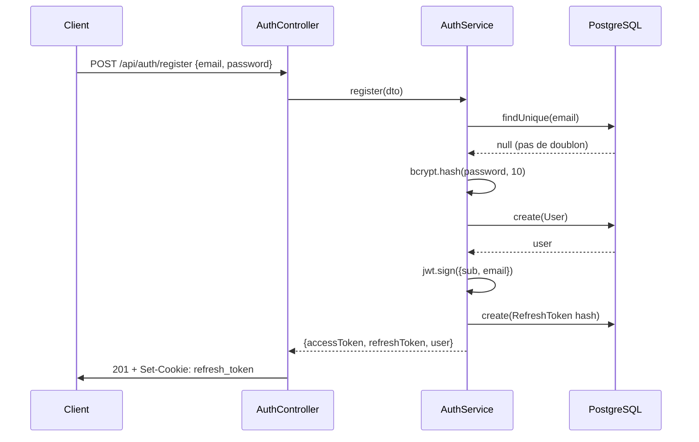
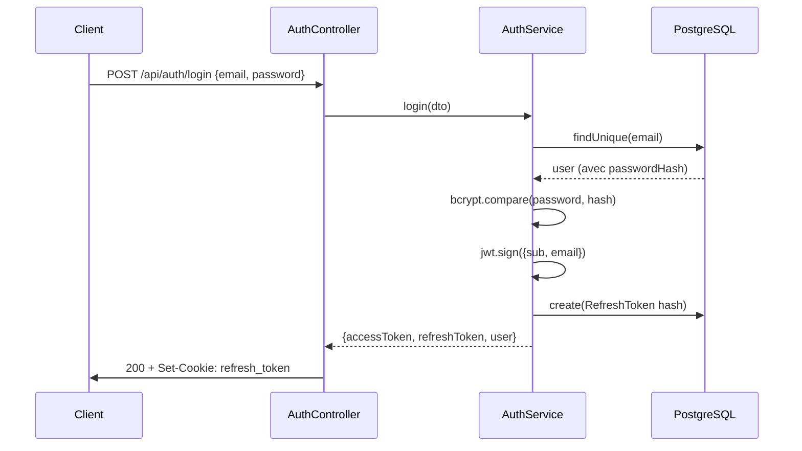

# Module d'authentification — US03 & US04

## Vue d'ensemble

Le AuthModule gère l'inscription des utilisateurs (US03) et l'authentification (US04) pour la plateforme DataShare. Il implémente une stratégie d'authentification basée sur JWT avec rotation des jetons de rafraîchissement.

## Architecture

```
backend/src/auth/
├── auth.module.ts          ← Déclaration du module NestJS
├── auth.controller.ts      ← 4 points de terminaison REST
├── auth.service.ts         ← Logique métier (register, login, logout, refresh)
├── dto/
│   ├── register.dto.ts     ← Validation des entrées pour l'inscription
│   └── login.dto.ts        ← Validation des entrées pour la connexion
└── guards/
    └── jwt.guard.ts        ← Guard réutilisable pour les routes protégées
```

## Routes API

| Méthode | Chemin | Auth | Description |
|---------|--------|------|-------------|
| `POST` | `/api/auth/register` | Non | Créer un nouveau compte |
| `POST` | `/api/auth/login` | Non | S'authentifier, obtenir les jetons |
| `POST` | `/api/auth/logout` | Oui (JWT) | Révoquer le jeton de rafraîchissement |
| `POST` | `/api/auth/refresh` | Non (cookie) | Renouveler le jeton d'accès |

## Stratégie de jetons

### Jeton d'accès (JWT)
- **Algorithme** : HS256
- **Charge utile** : `{ sub: user_id, email: user_email }`
- **Durée de vie** : 15 minutes (configurable via `JWT_EXPIRES_IN`)
- **Transport** : En-tête `Authorization: Bearer <token>`

### Jeton de rafraîchissement
- **Format** : UUID v4 (valeur brute)
- **Stockage** : Hachage bcrypt dans la table `refresh_tokens`
- **Durée de vie** : 7 jours (configurable via `REFRESH_TOKEN_EXPIRES_IN`)
- **Transport** : Cookie HttpOnly (`refresh_token`)
- **Options du cookie** : `HttpOnly`, `Secure`, `SameSite=Strict`, path `/api/auth`
- **Rotation** : Chaque rafraîchissement invalide l'ancien jeton et en émet un nouveau

### Hachage du mot de passe
- **Algorithme** : bcrypt
- **Tours de salage** : 10
- **Longueur minimale** : 8 caractères (validé dans le DTO)

## Diagrammes de séquence

### Inscription (US03)


```mermaid
sequenceDiagram
    participant C as Client
    participant A as AuthController
    participant S as AuthService
    participant DB as PostgreSQL

    C->>A: POST /api/auth/register {email, password}
    A->>S: register(dto)
    S->>DB: findUnique(email)
    DB-->>S: null (pas de doublon)
    S->>S: bcrypt.hash(password, 10)
    S->>DB: create(User)
    DB-->>S: user
    S->>S: jwt.sign({sub, email})
    S->>DB: create(RefreshToken hash)
    S-->>A: {accessToken, refreshToken, user}
    A->>C: 201 + Set-Cookie: refresh_token
```

### Connexion (US04)


```mermaid
sequenceDiagram
    participant C as Client
    participant A as AuthController
    participant S as AuthService
    participant DB as PostgreSQL

    C->>A: POST /api/auth/login {email, password}
    A->>S: login(dto)
    S->>DB: findUnique(email)
    DB-->>S: user (avec passwordHash)
    S->>S: bcrypt.compare(password, hash)
    S->>S: jwt.sign({sub, email})
    S->>DB: create(RefreshToken hash)
    S-->>A: {accessToken, refreshToken, user}
    A->>C: 200 + Set-Cookie: refresh_token
```

## JwtGuard

Guard réutilisable pour toute route protégée dans les futurs modules (Files, Download, Tags) :

```typescript
@UseGuards(JwtGuard)
@Get('protected-route')
async handler(@Req() req) {
  // req.user = { sub: 'user-id', email: '...' }
}
```

Le guard :
1. Extrait `Bearer <token>` de l'en-tête `Authorization`
2. Vérifie la signature JWT + l'expiration en utilisant `JWT_SECRET`
3. Attache la charge utile décodée à `request.user`
4. Lève une erreur `401 Unauthorized` si le jeton est manquant/invalide/expiré

## Réponses d'erreur

| Code | Erreur | Quand |
|------|--------|-------|
| 201 | — | Compte créé avec succès |
| 200 | — | Connexion / rafraîchissement réussi |
| 204 | — | Déconnexion réussie |
| 401 | `Unauthorized` | Identifiants invalides, jeton expiré/invalide |
| 409 | `Conflict` | E-mail déjà enregistré |
| 422 | `ValidationError` | Format d'e-mail invalide, mot de passe trop court |

## Tests

**Fichier** : `backend/src/auth/auth.service.spec.ts`

| Test | Scénario |
|------|----------|
| register — succès | Crée un utilisateur, retourne les jetons |
| register — e-mail en double | Lève une ConflictException |
| register — hachage du mot de passe | Vérifie que le hachage bcrypt est stocké |
| login — succès | Retourne les jetons pour des identifiants valides |
| login — e-mail inconnu | Lève une UnauthorizedException |
| login — mauvais mot de passe | Lève une UnauthorizedException |
| logout — succès | Révoque le jeton de rafraîchissement correspondant |
| logout — jeton inconnu | Ne fait rien (pas d'erreur) |
| refresh — succès | Émet de nouveaux jetons, effectue la rotation de l'ancien |
| refresh — jeton invalide | Lève une UnauthorizedException |

Exécuter les tests :
```bash
make test-backend
# ou
cd backend && npx jest --coverage
```

## Variables d'environnement

| Nom | Requis | Par défaut | Description |
|-----|--------|------------|-------------|
| `JWT_SECRET` | Oui | — | Clé de signature HMAC-SHA256 (min 32 caractères) |
| `JWT_EXPIRES_IN` | Non | `15m` | Durée de vie du jeton d'accès |
| `REFRESH_TOKEN_EXPIRES_IN` | Non | `7d` | Durée de vie du jeton de rafraîchissement |
| `DATABASE_URL` | Oui | — | Chaîne de connexion PostgreSQL |
