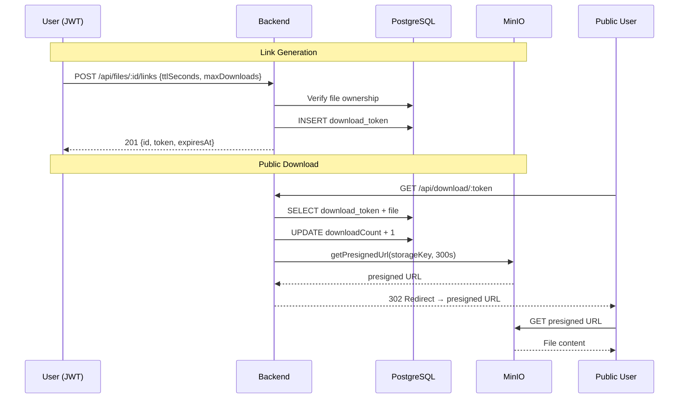

# US02 — Download Links

## Overview

Temporary, secure download links for shared file access without authentication.

## Routes

| Method | Path | Auth | Description |
|--------|------|------|-------------|
| `POST` | `/api/files/:id/links` | JWT | Generate a download token |
| `GET` | `/api/files/:id/links` | JWT | List active tokens for a file |
| `DELETE` | `/api/files/:id/links/:tokenId` | JWT | Revoke a token |
| `GET` | `/api/download/:token` | **Public** | Use token → HTTP 302 to MinIO presigned URL |

## How It Works

### Link Generation (`POST /api/files/:id/links`)

1. Verify file exists and belongs to authenticated user
2. Generate UUID v4 token
3. Store in `download_tokens` table with TTL and optional `maxDownloads`
4. Return token object (id, token, expiresAt, maxDownloads)

**Request body:**
```json
{
  "ttlSeconds": 3600,
  "maxDownloads": 10
}
```
Both fields optional. Defaults: `DOWNLOAD_LINK_TTL_SECONDS` env (86400s) and unlimited downloads.

### Public Download (`GET /api/download/:token`)

1. Look up token in DB (include file relation)
2. Check: token exists → expired? → file deleted? → maxDownloads reached?
3. Increment `downloadCount`
4. Generate MinIO presigned URL (5 min TTL)
5. HTTP 302 redirect to presigned URL

### Error Responses

| Code | Condition |
|------|-----------|
| 404 | Token not found |
| 404 | File deleted (`isDeleted = true`) |
| 410 Gone | Token expired (`expiresAt < now`) |
| 410 Gone | Download limit reached (`downloadCount >= maxDownloads`) |

## Environment Variables

| Name | Required | Default | Description |
|------|----------|---------|-------------|
| `DOWNLOAD_LINK_TTL_SECONDS` | No | `86400` | Default TTL for download links (seconds) |

## Database Schema

```
DownloadToken:
  id            UUID PK
  fileId        UUID FK → files.id
  token         VARCHAR(255) UNIQUE
  expiresAt     TIMESTAMP
  downloadCount INT (default 0)
  maxDownloads  INT (default 0, 0 = unlimited)
  createdAt     TIMESTAMP
```

## Tests

10 unit tests in `download.service.spec.ts`:
- createLink: valid creation, custom TTL, file not found, wrong owner
- findByFile: returns active tokens
- revokeLink: sets expiresAt to now, token not belonging to file
- useToken: valid download, token not found, expired, file deleted, maxDownloads reached

## Sequence Diagram


