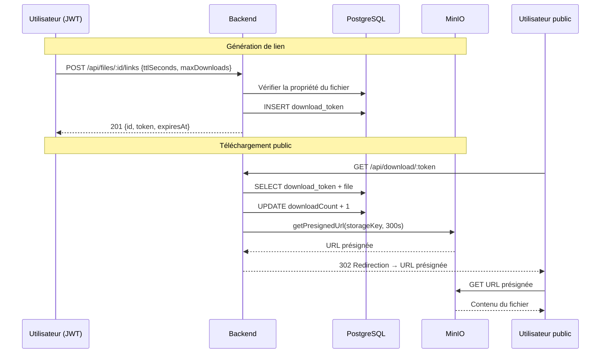

# US02 — Liens de téléchargement

## Vue d'ensemble

Liens de téléchargement temporaires et sécurisés pour l'accès aux fichiers partagés sans authentification.

## Routes

| Méthode | Chemin | Auth | Description |
|---------|--------|------|-------------|
| `POST` | `/api/files/:id/links` | JWT | Générer un jeton de téléchargement |
| `GET` | `/api/files/:id/links` | JWT | Lister les jetons actifs pour un fichier |
| `DELETE` | `/api/files/:id/links/:tokenId` | JWT | Révoquer un jeton |
| `GET` | `/api/download/:token` | **Public** | Utiliser le jeton → HTTP 302 vers l'URL présignée MinIO |

## Fonctionnement

### Génération de lien (`POST /api/files/:id/links`)

1. Vérifier que le fichier existe et appartient à l'utilisateur authentifié
2. Générer un jeton UUID v4
3. Stocker dans la table `download_tokens` avec une durée de vie et un `maxDownloads` optionnel
4. Retourner l'objet jeton (id, token, expiresAt, maxDownloads)

**Corps de la requête :**
```json
{
  "ttlSeconds": 3600,
  "maxDownloads": 10
}
```
Les deux champs sont optionnels. Valeurs par défaut : variable d'environnement `DOWNLOAD_LINK_TTL_SECONDS` (86400s) et téléchargements illimités.

### Téléchargement public (`GET /api/download/:token`)

1. Rechercher le jeton en base de données (inclure la relation fichier)
2. Vérifier : le jeton existe → expiré ? → fichier supprimé ? → limite de téléchargements atteinte ?
3. Incrémenter `downloadCount`
4. Générer une URL présignée MinIO (durée de vie de 5 min)
5. Redirection HTTP 302 vers l'URL présignée

### Réponses d'erreur

| Code | Condition |
|------|-----------|
| 404 | Jeton non trouvé |
| 404 | Fichier supprimé (`isDeleted = true`) |
| 410 Gone | Jeton expiré (`expiresAt < now`) |
| 410 Gone | Limite de téléchargements atteinte (`downloadCount >= maxDownloads`) |

## Variables d'environnement

| Nom | Requis | Par défaut | Description |
|-----|--------|------------|-------------|
| `DOWNLOAD_LINK_TTL_SECONDS` | Non | `86400` | Durée de vie par défaut des liens de téléchargement (secondes) |

## Schéma de base de données

```
DownloadToken:
  id            UUID PK
  fileId        UUID FK → files.id
  token         VARCHAR(255) UNIQUE
  expiresAt     TIMESTAMP
  downloadCount INT (default 0)
  maxDownloads  INT (default 0, 0 = illimité)
  createdAt     TIMESTAMP
```

## Tests

10 tests unitaires dans `download.service.spec.ts` :
- createLink : création valide, durée de vie personnalisée, fichier non trouvé, mauvais propriétaire
- findByFile : retourne les jetons actifs
- revokeLink : définit expiresAt à maintenant, jeton n'appartenant pas au fichier
- useToken : téléchargement valide, jeton non trouvé, expiré, fichier supprimé, limite de téléchargements atteinte

## Diagramme de séquence


```mermaid
sequenceDiagram
    participant U as Utilisateur (JWT)
    participant API as Backend
    participant DB as PostgreSQL
    participant M as MinIO

    Note over U,M: Génération de lien
    U->>API: POST /api/files/:id/links {ttlSeconds, maxDownloads}
    API->>DB: Vérifier la propriété du fichier
    API->>DB: INSERT download_token
    API-->>U: 201 {id, token, expiresAt}

    Note over U,M: Téléchargement public
    participant P as Utilisateur public
    P->>API: GET /api/download/:token
    API->>DB: SELECT download_token + file
    API->>DB: UPDATE downloadCount + 1
    API->>M: getPresignedUrl(storageKey, 300s)
    M-->>API: URL présignée
    API-->>P: 302 Redirection → URL présignée
    P->>M: GET URL présignée
    M-->>P: Contenu du fichier
```
