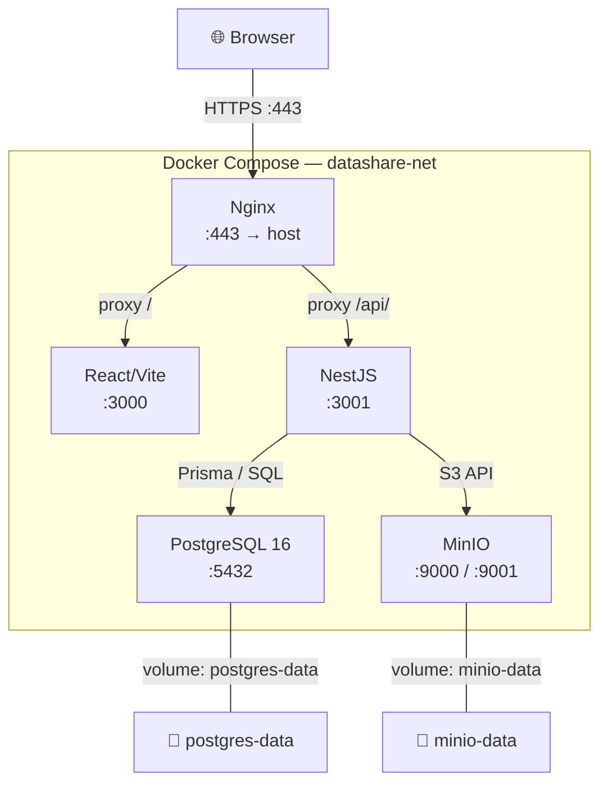

# Infrastructure Setup — Docker Compose

## Architecture Overview



## Services

| Service | Image | Internal Port | Exposed Port | Depends On |
|---------|-------|--------------|--------------|------------|
| nginx | nginx:alpine | 80, 443 | 443, 80 | frontend, backend |
| frontend | local build | 3000 | — | — |
| backend | local build | 3001 | — | postgres, minio |
| postgres | postgres:16-alpine | 5432 | — | — |
| minio | minio/minio:latest | 9000, 9001 | — | — |

## Quick Start

```bash
# 1. Clone the repo
git clone git@github.com:OC-Expert-DevOps/-P3-OC-software-development-management.git
cd P3-OC-software-development-management

# 2. Copy environment file
cp .env.example .env
# Edit .env with your values (especially secrets)

# 3. Generate self-signed TLS certificates (dev only)
make certs

# 4. Start all services
make up
# Or: docker compose -f infra/docker-compose.yml up --build

# 5. Verify
curl -k https://localhost/api/health
# → {"status":"ok","timestamp":"..."}
```

## Data Persistence

| Volume | Mount Point | Purpose |
|--------|------------|---------|
| `postgres-data` | `/var/lib/postgresql/data` | Database tables, indexes |
| `minio-data` | `/data` | Uploaded files (S3 objects) |

- `docker compose down` → data **preserved**
- `docker compose down -v` → data **deleted** (full reset)

## Network

All services communicate on the `datashare-net` bridge network. Only Nginx is exposed to the host (ports 80/443). All other services are internal only.

## Environment Variables

See `.env.example` for the full list. Key variables:

| Variable | Required | Type | Default | Description |
|----------|----------|------|---------|-------------|
| `DATABASE_URL` | Yes | url | — | PostgreSQL connection string |
| `POSTGRES_USER` | Yes | string | — | Database user |
| `POSTGRES_PASSWORD` | Yes | string | — | Database password |
| `POSTGRES_DB` | Yes | string | — | Database name |
| `JWT_SECRET` | Yes | string | — | HMAC-SHA256 signing secret (min 32 chars) |
| `JWT_EXPIRES_IN` | No | duration | `15m` | Access token TTL |
| `REFRESH_TOKEN_EXPIRES_IN` | No | duration | `7d` | Refresh token TTL |
| `MINIO_ENDPOINT` | Yes | string | `minio` | MinIO hostname |
| `MINIO_PORT` | No | int | `9000` | MinIO API port |
| `MINIO_ACCESS_KEY` | Yes | string | — | MinIO access key |
| `MINIO_SECRET_KEY` | Yes | string | — | MinIO secret key |
| `MINIO_BUCKET` | No | string | `datashare` | S3 bucket name |
| `MINIO_USE_SSL` | No | bool | `false` | TLS for MinIO (dev=false) |
| `APP_PORT` | No | int | `3001` | NestJS listen port |
| `MAX_FILE_SIZE_BYTES` | No | int | `1073741824` | Max upload size (1 GB) |
| `FILE_EXPIRY_DAYS_DEFAULT` | No | int | `7` | Default file expiry |
| `ALLOWED_ORIGINS` | No | string | `https://localhost` | CORS origins (comma-separated) |
