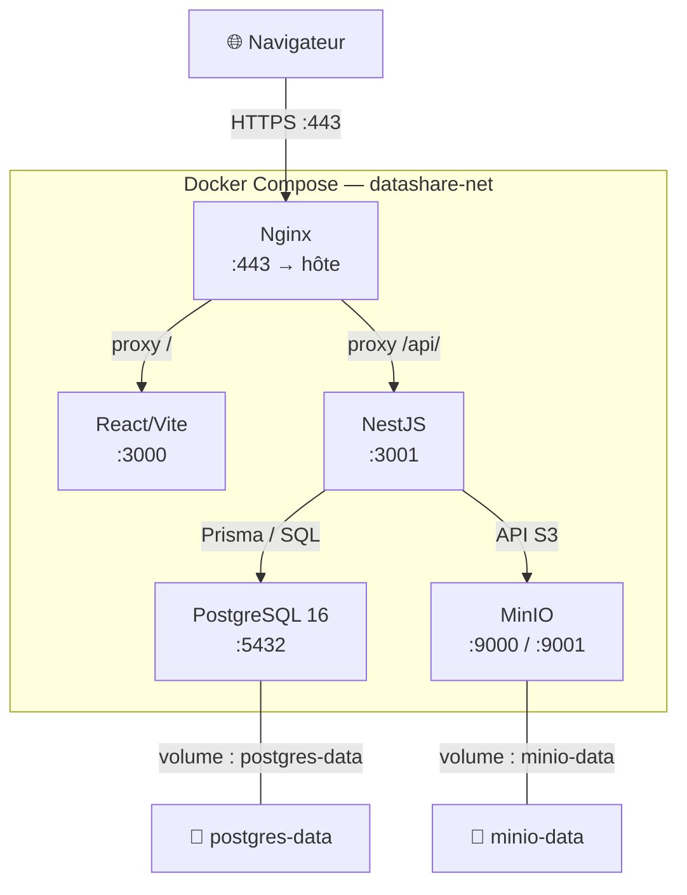

# Configuration de l'infrastructure — Docker Compose

## Vue d'ensemble de l'architecture


```mermaid
graph TD
    Browser["🌐 Navigateur"]
    
    subgraph DockerCompose["Docker Compose — datashare-net"]
        Nginx["Nginx<br/>:443 → hôte"]
        Frontend["React/Vite<br/>:3000"]
        Backend["NestJS<br/>:3001"]
        Postgres["PostgreSQL 16<br/>:5432"]
        MinIO["MinIO<br/>:9000 / :9001"]
    end
    
    Browser -->|"HTTPS :443"| Nginx
    Nginx -->|"proxy /"| Frontend
    Nginx -->|"proxy /api/"| Backend
    Backend -->|"Prisma / SQL"| Postgres
    Backend -->|"API S3"| MinIO
    
    Postgres ---|"volume : postgres-data"| PGVol["📁 postgres-data"]
    MinIO ---|"volume : minio-data"| MINVol["📁 minio-data"]
```

## Services

| Service | Image | Port interne | Port exposé | Dépend de |
|---------|-------|--------------|--------------|------------|
| nginx | nginx:alpine | 80, 443 | 443, 80 | frontend, backend |
| frontend | build local | 3000 | — | — |
| backend | build local | 3001 | — | postgres, minio |
| postgres | postgres:16-alpine | 5432 | — | — |
| minio | minio/minio:latest | 9000, 9001 | — | — |

## Démarrage rapide

```bash
# 1. Cloner le dépôt
git clone git@github.com:OC-Expert-DevOps/-P3-OC-software-development-management.git
cd P3-OC-software-development-management

# 2. Copier le fichier d'environnement
cp .env.example .env
# Modifier .env avec vos valeurs (surtout les secrets)

# 3. Générer les certificats TLS auto-signés (dev uniquement)
make certs

# 4. Démarrer tous les services
make up
# Ou : docker compose -f infra/docker-compose.yml up --build

# 5. Vérifier
curl -k https://localhost/api/health
# → {"status":"ok","timestamp":"..."}
```

## Persistance des données

| Volume | Point de montage | Objectif |
|--------|------------|---------|
| `postgres-data` | `/var/lib/postgresql/data` | Tables et index de la base de données |
| `minio-data` | `/data` | Fichiers uploadés (objets S3) |

- `docker compose down` → données **conservées**
- `docker compose down -v` → données **supprimées** (réinitialisation complète)

## Réseau

Tous les services communiquent sur le réseau bridge `datashare-net`. Seul Nginx est exposé à l'hôte (ports 80/443). Tous les autres services sont uniquement internes.

## Variables d'environnement

Voir `.env.example` pour la liste complète. Variables principales :

| Variable | Obligatoire | Type | Par défaut | Description |
|----------|----------|------|---------|-------------|
| `DATABASE_URL` | Oui | url | — | Chaîne de connexion PostgreSQL |
| `POSTGRES_USER` | Oui | string | — | Utilisateur de la base de données |
| `POSTGRES_PASSWORD` | Oui | string | — | Mot de passe de la base de données |
| `POSTGRES_DB` | Oui | string | — | Nom de la base de données |
| `JWT_SECRET` | Oui | string | — | Secret de signature HMAC-SHA256 (min 32 caractères) |
| `JWT_EXPIRES_IN` | Non | duration | `15m` | Durée de vie du jeton d'accès |
| `REFRESH_TOKEN_EXPIRES_IN` | Non | duration | `7d` | Durée de vie du jeton de rafraîchissement |
| `MINIO_ENDPOINT` | Oui | string | `minio` | Nom d'hôte MinIO |
| `MINIO_PORT` | Non | int | `9000` | Port API MinIO |
| `MINIO_ACCESS_KEY` | Oui | string | — | Clé d'accès MinIO |
| `MINIO_SECRET_KEY` | Oui | string | — | Clé secrète MinIO |
| `MINIO_BUCKET` | Non | string | `datashare` | Nom du bucket S3 |
| `MINIO_USE_SSL` | Non | bool | `false` | TLS pour MinIO (dev=false) |
| `APP_PORT` | Non | int | `3001` | Port d'écoute NestJS |
| `MAX_FILE_SIZE_BYTES` | Non | int | `1073741824` | Taille maximale d'upload (1 Go) |
| `FILE_EXPIRY_DAYS_DEFAULT` | Non | int | `7` | Expiration par défaut des fichiers |
| `ALLOWED_ORIGINS` | Non | string | `https://localhost` | Origines CORS (séparées par des virgules) |
