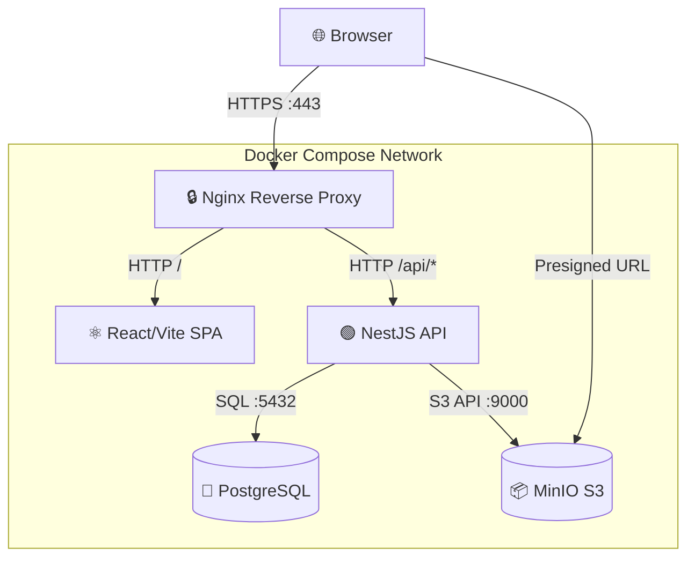
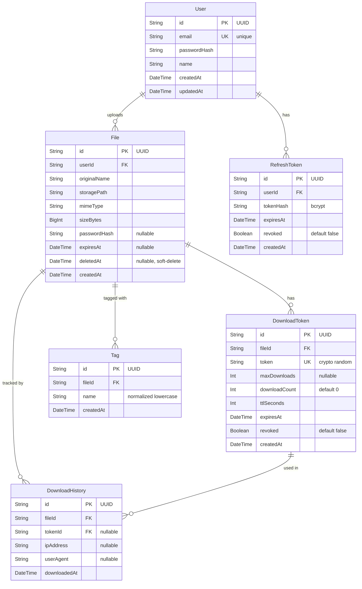

# Documentation Technique — DataShare

Plateforme de transfert sécurisé de fichiers pour freelances et petites entreprises.

---

## 1. Architecture de l'application

### Diagramme d'architecture



### Description des briques

| Brique | Rôle | Port interne |
|--------|------|-------------|
| **Nginx** | Reverse proxy, TLS termination, routing | 443, 80 |
| **Frontend** | SPA React (Vite dev server) | 5173 |
| **Backend** | API REST NestJS | 3001 |
| **PostgreSQL** | Base de données relationnelle | 5432 |
| **MinIO** | Stockage objet S3-compatible | 9000 (API), 9001 (Console) |

### Flux de données

- **Browser → Nginx** : HTTPS (TLS termination)
- **Nginx → Frontend** : HTTP proxy pour les routes `/`
- **Nginx → Backend** : HTTP proxy pour les routes `/api/*`
- **Backend → PostgreSQL** : TCP/SQL via Prisma ORM
- **Backend → MinIO** : S3 API (AWS SDK v3) via HTTP
- **Browser → MinIO** : Presigned URLs pour téléchargement direct

> 📖 Diagrammes complets : [`docs/architecture/01-architecture-overview.md`](architecture/01-architecture-overview.md)

---

## 2. Choix technologiques justifiés

| Élément | Technologie choisie | Alternatives considérées | Justification |
|---------|---------------------|--------------------------|---------------|
| **Langage backend** | TypeScript (Node.js 20) | Python, Go, Java | Écosystème unifié front+back, typage statique, productivité MVP |
| **Framework backend** | NestJS 10 | Express, Fastify, Koa | Architecture modulaire, DI natif, Swagger auto, conventions fortes |
| **Langage frontend** | TypeScript + React 18 | Vue.js, Angular, Svelte | Écosystème le plus large, facilité de recrutement, richesse de composants |
| **Bundler frontend** | Vite 5 | Webpack, Parcel | Build ultra-rapide, HMR instantané, config minimale |
| **Base de données** | PostgreSQL 16 | MySQL, MongoDB | Standard SQL, robustesse, types avancés (UUID, BigInt), gratuit |
| **ORM** | Prisma 5 | TypeORM, Sequelize, Knex | Schema-first, migrations typées, client auto-généré, DX excellente |
| **Stockage fichiers** | MinIO (S3-compatible) | AWS S3, local filesystem | Self-hosted, API S3 standard, zero vendor lock-in, gratuit |
| **Authentification** | JWT HS256 + Refresh tokens | OAuth2, sessions, Passport.js | Stateless, scalable, rotation de tokens pour sécurité renforcée |
| **Reverse proxy** | Nginx | Traefik, Caddy | Maturité, performance, TLS termination simple, documentation abondante |
| **Containerisation** | Docker Compose | Kubernetes, Podman | Simplicité pour MVP/demo, un seul `docker compose up` |
| **Tests unitaires** | Jest | Mocha, Vitest | Intégré NestJS, mocking natif, coverage intégrée |
| **Tests E2E** | Playwright | Cypress, Selenium | Multi-navigateur, rapide, API moderne, fixtures natives |
| **Perf testing** | k6 (Grafana) | JMeter, Artillery | Scriptable en JS, léger, métriques précises, CI-friendly |

---

## 3. Modèle de données

### Diagramme entité-relation



> 📖 Schema Prisma complet : [`backend/prisma/schema.prisma`](../backend/prisma/schema.prisma)
> 📖 Documentation MCD : [`docs/architecture/02-database-schema.md`](architecture/02-database-schema.md)

---

## 4. Documentation d'API

L'API REST est documentée au format **OpenAPI 3.0** :

📖 **Fichier** : [`docs/architecture/openapi.yaml`](architecture/openapi.yaml)

### Résumé des routes (14 endpoints)

| Méthode | Path | Auth | Description |
|---------|------|------|-------------|
| `POST` | `/api/auth/register` | Public | Inscription |
| `POST` | `/api/auth/login` | Public | Connexion (JWT + cookie) |
| `POST` | `/api/auth/logout` | JWT | Déconnexion (révoque refresh) |
| `POST` | `/api/auth/refresh` | Cookie | Renouvellement du token |
| `POST` | `/api/files/upload` | JWT | Upload de fichier |
| `POST` | `/api/files/anonymous` | Public | Upload anonyme (1 jour) |
| `GET` | `/api/files` | JWT | Liste paginée des fichiers |
| `GET` | `/api/files/stats` | JWT | Statistiques utilisateur |
| `GET` | `/api/files/:id` | JWT | Métadonnées d'un fichier |
| `DELETE` | `/api/files/:id` | JWT | Suppression (soft-delete) |
| `POST` | `/api/files/:id/links` | JWT | Générer un lien temporaire |
| `GET` | `/api/files/:id/links` | JWT | Lister les liens actifs |
| `DELETE` | `/api/files/:id/links/:tokenId` | JWT | Révoquer un lien |
| `GET` | `/api/download/:token` | Public | Téléchargement (302 → MinIO) |

**Documentation interactive** : Swagger UI disponible à `https://localhost/api/docs` quand la stack est démarrée.

---

## 5. Sécurité et gestion des accès

### Authentification

| Mécanisme | Détails |
|-----------|---------|
| **Accès** | JWT HS256, TTL 15 min, header `Authorization: Bearer` |
| **Refresh** | UUID v4, bcrypt hash en DB, cookie HttpOnly/Secure/SameSite, TTL 7 jours |
| **Rotation** | Le refresh token est révoqué + remplacé à chaque usage |
| **Logout** | Révocation du refresh token en base |

### Mesures de sécurisation

| Mesure | Implémentation |
|--------|----------------|
| Chiffrement mots de passe | bcrypt (salt rounds: 10) |
| TLS en transit | Nginx reverse proxy avec HTTPS |
| Validation entrées | class-validator sur tous les DTOs |
| Injection SQL | Prisma ORM (requêtes paramétrées) |
| Taille upload | `MAX_FILE_SIZE_BYTES` configurable (défaut 1 GB) |
| CORS | Restreint à `ALLOWED_ORIGINS` |
| Secrets | Variables d'env uniquement, jamais dans le code |
| Liens de téléchargement | Tokens crypto-aléatoires, TTL + nombre max de downloads |
| Protection par mot de passe | bcrypt hash optionnel par fichier |

### Limites actuelles (MVP)

- Pas de rate limiting (recommandé pour production)
- Pas de verification email à l'inscription
- Pas de CSP headers Nginx (recommandé)
- Pas de verrouillage de compte après N tentatives échouées

> 📖 Audit de sécurité complet : [`docs/security/SECURITY.md`](security/SECURITY.md)

---

## 6. Qualité, tests et maintenance

### Plan de tests

| Type | Outil | Couverture | Résultat |
|------|-------|-----------|----------|
| **Tests unitaires** | Jest | 68 tests, 6 suites, **72.82% coverage** | ✅ All pass |
| **Tests E2E** | Playwright | 21 tests, 10 specs (US01-US10) | ✅ All pass |
| **Tests de performance** | k6 | Upload p95 ~350ms, 0% erreurs | ✅ Within targets |
| **Scan de sécurité** | npm audit | 47 vulns (toutes transitives/dev-only) | ✅ Documented |

### Fichiers de référence

| Fichier | Contenu |
|---------|---------|
| [`docs/testing/TESTING.md`](testing/TESTING.md) | Plan de tests, critères d'acceptation, instructions d'exécution |
| [`docs/security/SECURITY.md`](security/SECURITY.md) | Résultats npm audit + revue de sécurité applicative |
| [`docs/performance/PERF.md`](performance/PERF.md) | Tests k6 upload/download, budget front, métriques clés |
| [`docs/maintenance/MAINTENANCE.md`](maintenance/MAINTENANCE.md) | Procédures mise à jour, backup, rollback, monitoring |

### Résumé couverture de code

```
--------------------|---------|----------|---------|---------|
File                | % Stmts | % Branch | % Funcs | % Lines |
--------------------|---------|----------|---------|---------|
All files           |   72.82 |    47.36 |   68.42 |   73.13 |
 auth.service.ts    |     100 |      100 |     100 |     100 |
 auth.controller.ts |    87.5 |      100 |     100 |    87.5 |
 jwt.guard.ts       |     100 |    66.66 |     100 |     100 |
 files.service.ts   |   95.28 |    63.15 |     100 |   95.28 |
 download.service   |    92.3 |    71.42 |     100 |   93.33 |
 download.ctrl.ts   |     100 |      100 |     100 |     100 |
--------------------|---------|----------|---------|---------|
```

---

## 7. Processus d'installation et d'exécution

### Prérequis

- **Docker** & **Docker Compose** v2
- **Node.js** 20+ (développement local seulement)
- **Git**

### Installation

```bash
# 1. Cloner le repo
git clone git@github.com:OC-Expert-DevOps/P3-OC-software-development-management.git
cd P3-OC-software-development-management

# 2. Configurer l'environnement
cp .env.example .env
# Modifier .env si nécessaire

# 3. Générer les certificats TLS (dev)
make certs

# 4. Lancer la stack
make up
# ou: docker compose -f infra/docker-compose.yml up --build
```

### Vérification

```bash
# Health check
curl -k https://localhost/api/health
# → {"status":"ok"}

# Accès navigateur
# Frontend : https://localhost
# Swagger  : https://localhost/api/docs
# MinIO    : http://localhost:9001
```

### Scripts de déploiement

| Commande | Description |
|----------|-------------|
| `make up` | Démarre toute la stack |
| `make down` | Arrête la stack |
| `make reset` | Détruit volumes + relance (reset complet) |
| `make certs` | Génère certificats TLS auto-signés |
| `make logs` | Affiche les logs de tous les services |

### Variables d'environnement

> Voir le tableau complet dans [`README.md`](../README.md#configuration) (18 variables documentées).

---

## 8. Utilisation de l'IA dans le développement

### Posture adoptée

Approche **hybride binômage + supervision** :
- L'IA (Cline/Claude + GitHub Copilot) est utilisée comme un **développeur junior** supervisé
- Chaque livrable est **revu, corrigé et validé** par le développeur humain
- Les décisions d'architecture sont prises par le développeur humain

### Tâches confiées à l'IA

| Tâche | Outil | Supervision |
|-------|-------|-------------|
| Architecture & diagrammes | Cline/Claude | Revue structure + pertinence |
| Génération de code (US01) | GitHub Copilot | 5 corrections humaines documentées |
| Tests unitaires & E2E | Cline/Claude | Revue des assertions + fixtures |
| Documentation technique | Cline/Claude | Validation contenu + cohérence |
| Configuration Docker/Nginx | Cline/Claude | Tests manuels complets |
| Debugging (MinIO SSL, BigInt) | Cline/Claude | Diagnostic guidé par logs réels |

### Supervision et corrections apportées

**Exemple documenté : US01 — File Upload (GitHub Copilot)**

5 corrections humaines sur le code généré par Copilot :
1. **Manque de validation** — Ajout de validation de taille de fichier
2. **Mauvais import** — Correction des imports Prisma
3. **Sécurité** — Ajout de vérification d'ownership sur delete
4. **Soft-delete** — Copilot proposait un hard-delete, changé en soft-delete
5. **Typage** — Correction des types BigInt vs Number

> 📖 Log complet : [`docs/ai-usage/us01-supervision-log.md`](ai-usage/us01-supervision-log.md)
> 📖 Prompts utilisés : [`docs/ai-usage/us01-copilot-prompts.md`](ai-usage/us01-copilot-prompts.md)

### Apports et limites constatés

| Aspect | Constat |
|--------|---------|
| **Gain de temps** | ~60% plus rapide sur le scaffolding, tests, docs |
| **Qualité initiale** | Code fonctionnel mais souvent incomplet (validation, edge cases) |
| **Erreurs typiques** | Imports erronés, types approximatifs, sécurité insuffisante |
| **Debugging** | Très efficace quand on fournit les logs réels (ex: MinIO EPROTO) |
| **Limite principale** | Ne remplace pas la revue humaine sur la sécurité et l'architecture |
| **Recommandation** | Toujours relire + tester manuellement le code généré avant merge |
