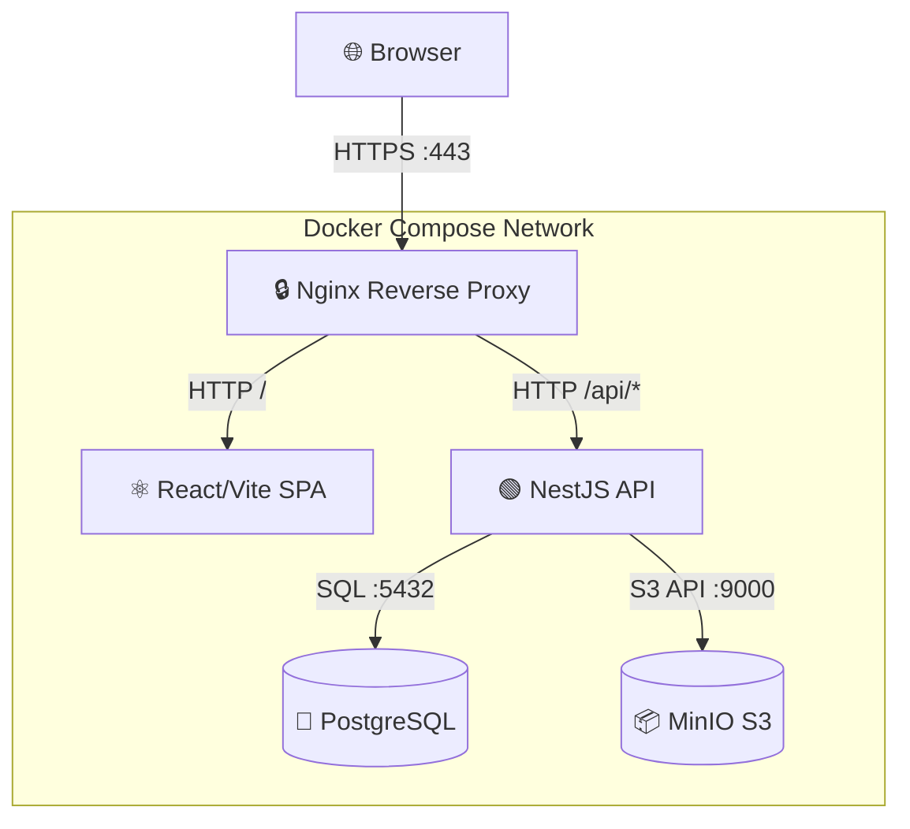
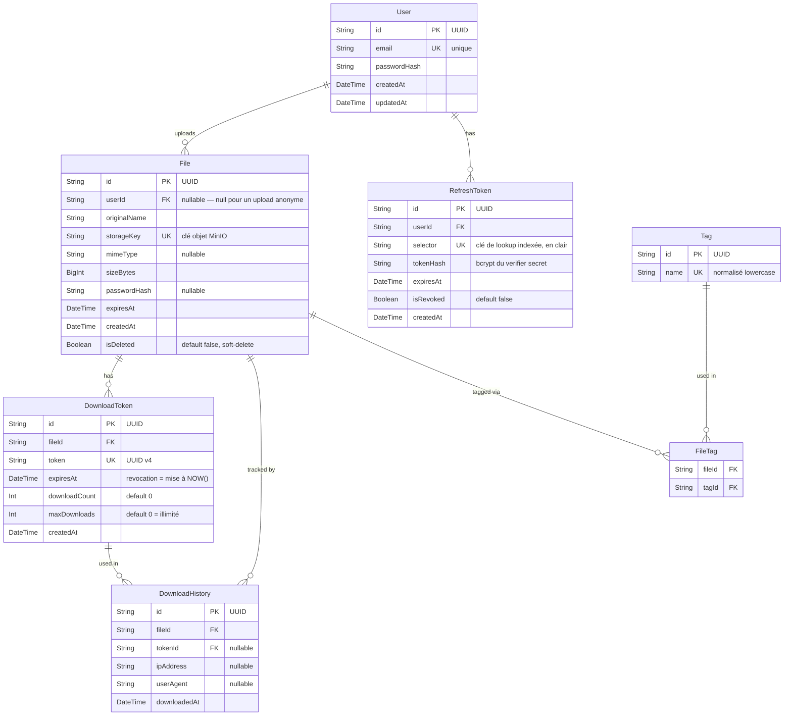

# Documentation Technique — DataShare

Plateforme de transfert sécurisé de fichiers pour freelances et petites entreprises.

> Mise à jour 2026-07-08 : cette section a été resynchronisée avec le code après une série de 5 correctifs post-soutenance (issues #55 à #63, PR #56/#58/#60/#62/#64) qui ont notamment corrigé le contrat d'API, la sécurité back-end, la performance et l'accessibilité front-end. Voir la section 6 pour le détail.

---

## 1. Architecture de l'application

### Diagramme d'architecture



### Description des briques

| Brique | Rôle | Port interne |
|--------|------|-------------|
| **Nginx** | Reverse proxy, TLS termination, routing, en-têtes de sécurité (CSP, HSTS) | 443, 80 |
| **Frontend** | SPA React (Vite dev server) | 5173 |
| **Backend** | API REST NestJS | 3001 |
| **PostgreSQL** | Base de données relationnelle | 5432 |
| **MinIO** | Stockage objet S3-compatible | 9000 (API), 9001 (Console) |

### Flux de données

- **Browser → Nginx** : HTTPS (TLS termination)
- **Nginx → Frontend** : HTTP proxy pour les routes `/`
- **Nginx → Backend** : HTTP proxy pour les routes `/api/*`
- **Backend → PostgreSQL** : TCP/SQL via Prisma ORM
- **Backend → MinIO** : S3 API (AWS SDK v3) via HTTP

Le téléchargement d'un fichier est **proxié par le backend** (`GET /api/download/:token` lit l'objet dans MinIO et le streame directement à l'appelant) — il n'y a pas de redirection vers une URL présignée exposée au navigateur.

> 📖 Diagrammes de séquence complets et à jour : [`docs/architecture/03-sequence-diagrams.md`](architecture/03-sequence-diagrams.md)

---

## 2. Choix technologiques justifiés

| Élément | Technologie choisie | Alternatives considérées | Justification |
|---------|---------------------|--------------------------|---------------|
| **Langage backend** | TypeScript (Node.js 20) | Python, Go, Java | Écosystème unifié front+back, typage statique, productivité MVP |
| **Framework backend** | NestJS 10 | Express, Fastify, Koa | Architecture modulaire, DI natif, Swagger auto, conventions fortes |
| **Langage frontend** | TypeScript + React 18 | Vue.js, Angular, Svelte | Écosystème le plus large, facilité de recrutement, richesse de composants |
| **Bundler frontend** | Vite 5 | Webpack, Parcel | Build ultra-rapide, HMR instantané, config minimale |
| **Base de données** | PostgreSQL 16 | MySQL, MongoDB | Standard SQL, robustesse, types avancés (UUID, BigInt), gratuit |
| **ORM** | Prisma 5 | TypeORM, Sequelize, Knex | Schema-first, `prisma db push` pour la synchro de schéma, client auto-généré, DX excellente |
| **Stockage fichiers** | MinIO (S3-compatible) | AWS S3, local filesystem | Self-hosted, API S3 standard, zero vendor lock-in, gratuit |
| **Authentification** | JWT HS256 + Refresh tokens (pattern selector/verifier) | OAuth2, sessions, Passport.js | Stateless, scalable, rotation de tokens, lookup indexé du refresh token |
| **Rate limiting** | `@nestjs/throttler` | Nginx `limit_req`, middleware custom | Intégré au framework, configurable par route via décorateur |
| **Reverse proxy** | Nginx | Traefik, Caddy | Maturité, performance, TLS termination simple, documentation abondante |
| **Containerisation** | Docker Compose | Kubernetes, Podman | Simplicité pour MVP/demo, un seul `docker compose up` |
| **Tests unitaires** | Jest | Mocha, Vitest | Intégré NestJS, mocking natif, coverage intégrée |
| **Tests E2E** | Playwright | Cypress, Selenium | Multi-navigateur, rapide, API moderne, fixtures natives |
| **Perf testing** | k6 (Grafana) | JMeter, Artillery | Scriptable en JS, léger, métriques précises, CI-friendly |

---

## 3. Modèle de données

### Diagramme entité-relation



Points notables :
- **`File` et `DownloadToken` sont deux entités distinctes** : l'upload ne génère pas de lien de partage automatiquement, il faut un appel explicite à `POST /files/:id/links` pour créer un `DownloadToken`. Un fichier peut avoir plusieurs liens actifs simultanément, avec des `maxDownloads`/TTL différents.
- **`Tag` est partagé entre fichiers** (relation many-to-many via `FileTag`), pas un champ direct sur `File`.
- **`RefreshToken.selector`** est la clé de recherche indexée (non secrète) d'un pattern selector/verifier : le token renvoyé au client est `${selector}.${verifier}`, seul le hash bcrypt du verifier est stocké (`tokenHash`).

> 📖 Schema Prisma complet (source de vérité) : [`backend/prisma/schema.prisma`](../backend/prisma/schema.prisma)

---

## 4. Documentation d'API

L'API REST est documentée au format **OpenAPI 3.0**, synchronisée avec le code (21 routes) :

📖 **Fichier** : [`docs/architecture/openapi.yaml`](architecture/openapi.yaml)

### Résumé des routes (21 endpoints)

| Méthode | Path | Auth | Description |
|---------|------|------|-------------|
| `GET` | `/api/health` | Public | Health check |
| `POST` | `/api/auth/register` | Public | Inscription |
| `POST` | `/api/auth/login` | Public | Connexion (JWT + cookie refresh) |
| `POST` | `/api/auth/logout` | JWT | Déconnexion (révoque le refresh token) |
| `POST` | `/api/auth/refresh` | Cookie | Renouvellement du token (rotation) |
| `POST` | `/api/files/upload` | JWT | Upload de fichier |
| `POST` | `/api/files/anonymous` | Public | Upload anonyme (expiration fixe 24h) |
| `GET` | `/api/files` | JWT | Liste des fichiers de l'utilisateur (pas de pagination ni filtre à ce jour — voir Limites) |
| `GET` | `/api/files/stats` | JWT | Statistiques utilisateur |
| `GET` | `/api/files/:id` | JWT | Métadonnées d'un fichier |
| `DELETE` | `/api/files/:id` | JWT | Suppression (soft-delete + purge MinIO) |
| `PUT` | `/api/files/:id/password` | JWT | Définir/remplacer le mot de passe du fichier |
| `DELETE` | `/api/files/:id/password` | JWT | Retirer le mot de passe |
| `PUT` | `/api/files/:id/tags` | JWT | Remplacer les tags du fichier (remplacement complet) |
| `GET` | `/api/files/:id/tags` | JWT | Lire les tags du fichier |
| `GET` | `/api/files/:id/history` | JWT | Historique des téléchargements du fichier |
| `POST` | `/api/files/:id/links` | JWT | Générer un lien de téléchargement temporaire |
| `GET` | `/api/files/:id/links` | JWT | Lister les liens actifs |
| `DELETE` | `/api/files/:id/links/:tokenId` | JWT | Révoquer un lien |
| `GET` | `/api/download/:token/info` | Public | Métadonnées du fichier avant téléchargement |
| `GET` | `/api/download/:token` | Public | Téléchargement (streamé directement par le backend) |

**Documentation interactive** : Swagger UI disponible à `https://localhost/api/docs` quand la stack est démarrée.

---

## 5. Sécurité et gestion des accès

### Authentification

| Mécanisme | Détails |
|-----------|---------|
| **Accès** | JWT HS256, TTL 15 min, header `Authorization: Bearer` |
| **Refresh** | Pattern selector/verifier — `${selector}.${verifier}`, `selector` indexé en clair, bcrypt hash du `verifier` en DB, cookie HttpOnly/Secure/SameSite, TTL 7 jours |
| **Lookup** | Recherche indexée par `selector` (O(1)), un seul `bcrypt.compare()` par appel — plus de scan linéaire des tokens actifs |
| **Rotation** | Le refresh token est révoqué + remplacé à chaque usage |
| **Logout** | Révocation du refresh token en base |

### Mesures de sécurisation

| Mesure | Implémentation |
|--------|----------------|
| Chiffrement mots de passe | bcrypt (salt rounds : 10) |
| TLS en transit | Nginx reverse proxy avec HTTPS |
| Validation entrées | class-validator sur tous les DTOs, `ValidationPipe` global (whitelist + forbidNonWhitelisted) |
| Injection SQL | Prisma ORM (requêtes paramétrées) |
| Type de fichier à l'upload | Whitelist de MIME types vérifiée par analyse du contenu réel (`file-type`), pas par extension déclarée |
| Taille upload | `MAX_FILE_SIZE_BYTES` configurable (défaut 1 Go) |
| Rate limiting | `@nestjs/throttler` — 120 req/min/IP par défaut, 30 req/min sur `/auth/*`, 10-20 req/min sur les endpoints de téléchargement public |
| En-têtes de sécurité | Nginx : `X-Frame-Options`, `X-Content-Type-Options`, `X-XSS-Protection`, `Content-Security-Policy`, `Strict-Transport-Security` |
| CORS | Restreint à `ALLOWED_ORIGINS` |
| Secrets | Variables d'env uniquement, jamais dans le code |
| Liens de téléchargement | Tokens crypto-aléatoires, TTL + nombre max de téléchargements appliqué par incrément atomique (résistant à la concurrence) |
| Protection par mot de passe | bcrypt hash optionnel par fichier, jamais renvoyé au client (seul un booléen `hasPassword` l'est) |

### Limites actuelles connues

- Pas de vérification email à l'inscription
- Pas de verrouillage de compte après N tentatives échouées
- CSP `script-src` inclut `'unsafe-inline'` tant que le frontend est servi par le serveur de développement Vite (React Fast Refresh) — à retirer une fois un vrai build de production (`vite build`) mis en place
- `GET /api/files` ne propose ni pagination ni filtrage par tag (un DTO `ListFilesDto` existe mais n'est pas branché) — les tags sont gérables par API mais pas encore visibles/filtrables depuis l'interface

> 📖 Audit de sécurité complet : [`docs/security/SECURITY.md`](security/SECURITY.md)
> 📖 Démarche d'accessibilité : [`docs/accessibility/ACCESSIBILITY.md`](accessibility/ACCESSIBILITY.md)

---

## 6. Qualité, tests et maintenance

### Plan de tests

| Type | Outil | Couverture | Résultat |
|------|-------|-----------|----------|
| **Tests unitaires** | Jest | 78 tests, 9 suites | ✅ All pass |
| **Tests E2E** | Playwright | 21 tests, 10 specs (US01-US10) | ✅ All pass (fixtures et Page Objects resynchronisés avec la refonte Figma du frontend) |
| **Tests de performance** | k6 | Voir [`docs/performance/PERF.md`](performance/PERF.md) | ✅ Within targets |

### Seuils de couverture (bloquants, `backend/package.json`)

| Métrique | Seuil | Couverture réelle mesurée |
|----------|-------|---------------------------|
| Statements | 75% | 77.96% |
| Branches | 65% | 72.52% |
| Functions | 68% | 71.42% |
| Lines | 75% | 78.75% |

Les seuils `branches`/`functions` ont été relevés (respectivement depuis 50%/60%) pour verrouiller la non-régression, conformément à la remarque de relecture reçue lors de la soutenance.

### Corrections post-soutenance (traçabilité)

Cinq axes d'amélioration identifiés lors de la relecture ont été corrigés et mergés après la soutenance :

| Axe | Contenu | Issue / PR |
|-----|---------|-----------|
| 1. Cohérence documentation/code | Réécriture complète d'`openapi.yaml` (12→21 routes), diagrammes de séquence, valeurs d'environnement | #55 / #56 |
| 2. Sécurité back-end | Whitelist MIME réelle, rate limiting, en-têtes CSP/HSTS, correction d'une fuite de `passwordHash` | #57 / #58 |
| 3. Performance | Lookup indexé des refresh tokens (fin du scan linéaire), incrément atomique de `maxDownloads` | #61 / #62 |
| 4. Front-end | Attributs ARIA, point de rupture responsive tablette, suppression de code mort | #63 / #64 |
| 5. Rigueur des tests | Correction du fixture E2E cassé par la refonte Figma, suppression des assertions complaisantes, relèvement des seuils de couverture | #59 / #60 |

### Fichiers de référence

| Fichier | Contenu |
|---------|---------|
| [`docs/testing/TESTING.md`](testing/TESTING.md) | Plan de tests, critères d'acceptation, instructions d'exécution |
| [`docs/security/SECURITY.md`](security/SECURITY.md) | Résultats npm audit + revue de sécurité applicative |
| [`docs/performance/PERF.md`](performance/PERF.md) | Tests k6 upload/download, budget front, métriques clés |
| [`docs/maintenance/MAINTENANCE.md`](maintenance/MAINTENANCE.md) | Procédures mise à jour, backup, rollback, monitoring |
| [`docs/accessibility/ACCESSIBILITY.md`](accessibility/ACCESSIBILITY.md) | Démarche d'accessibilité, ce qui est couvert, limites connues |

---

## 7. Processus d'installation et d'exécution

### Prérequis

- **Docker** & **Docker Compose** v2
- **Node.js** 20+ (développement local seulement)
- **Git**

### Installation

```bash
# 1. Cloner le repo
git clone git@github.com:OC-Expert-DevOps/P3-OC-software-development-management.git
cd P3-OC-software-development-management

# 2. Configurer l'environnement
cp .env.example .env
# Modifier .env si nécessaire

# 3. Générer les certificats TLS (dev)
make certs

# 4. Lancer la stack
make up
# ou: docker compose -f infra/docker-compose.yml up --build

# 5. Synchroniser le schéma Prisma
docker compose -f infra/docker-compose.yml exec backend npx prisma db push
```

### Vérification

```bash
# Health check
curl -k https://localhost/api/health
# → {"status":"ok"}

# Accès navigateur
# Frontend : https://localhost
# Swagger  : https://localhost/api/docs
# MinIO    : http://localhost:9001
```

### Scripts de déploiement

| Commande | Description |
|----------|-------------|
| `make up` | Démarre toute la stack (build + premier plan) |
| `make up-d` | Démarre toute la stack en arrière-plan |
| `make down` | Arrête la stack (données préservées) |
| `make reset` | Détruit les volumes + relance (reset complet) |
| `make certs` | Génère les certificats TLS auto-signés |
| `make logs` | Affiche les logs de tous les services |
| `make test-backend` | Lance les tests unitaires backend |
| `make test-backend-cov` | Lance les tests backend avec couverture |
| `make lint-frontend` | Lint ESLint du frontend (⚠️ ne fonctionne pas actuellement — aucune configuration ESLint n'existe dans `frontend/`) |

### Variables d'environnement

> Voir le tableau complet dans [`README.md`](../README.md#configuration) (19 variables documentées).

---

## 8. Utilisation de l'IA dans le développement

### Posture adoptée

Approche **hybride binômage + supervision** :
- L'IA (Cline/Claude + GitHub Copilot) est utilisée comme un **développeur junior** supervisé
- Chaque livrable est **revu, corrigé et validé** par le développeur humain
- Les décisions d'architecture sont prises par le développeur humain

### Tâches confiées à l'IA

| Tâche | Outil | Supervision |
|-------|-------|-------------|
| Architecture & diagrammes | Cline/Claude | Revue structure + pertinence |
| Génération de code (US01) | GitHub Copilot | 5 corrections humaines documentées |
| Tests unitaires & E2E | Cline/Claude | Revue des assertions + fixtures |
| Documentation technique | Cline/Claude | Validation contenu + cohérence |
| Configuration Docker/Nginx | Cline/Claude | Tests manuels complets |
| Debugging (MinIO SSL, BigInt) | Cline/Claude | Diagnostic guidé par logs réels |
| Corrections post-soutenance (axes 1 à 5) | Claude Code | Chaque correctif vérifié en conditions réelles (Docker Compose, curl, Playwright) avant merge, issue + PR dédiées par axe |

### Supervision et corrections apportées

**Exemple documenté : US01 — File Upload (GitHub Copilot)**

5 corrections humaines sur le code généré par Copilot :
1. **Manque de validation** — Ajout de validation de taille de fichier
2. **Mauvais import** — Correction des imports Prisma
3. **Sécurité** — Ajout de vérification d'ownership sur delete
4. **Soft-delete** — Copilot proposait un hard-delete, changé en soft-delete
5. **Typage** — Correction des types BigInt vs Number

> 📖 Log complet : [`docs/ai-usage/us01-supervision-log.md`](ai-usage/us01-supervision-log.md)
> 📖 Prompts utilisés : [`docs/ai-usage/us01-copilot-prompts.md`](ai-usage/us01-copilot-prompts.md)

### Apports et limites constatés

| Aspect | Constat |
|--------|---------|
| **Gain de temps** | ~60% plus rapide sur le scaffolding, tests, docs |
| **Qualité initiale** | Code fonctionnel mais souvent incomplet (validation, edge cases) |
| **Erreurs typiques** | Imports erronés, types approximatifs, sécurité insuffisante |
| **Debugging** | Très efficace quand on fournit les logs réels (ex: MinIO EPROTO) |
| **Limite principale** | Ne remplace pas la revue humaine sur la sécurité et l'architecture |
| **Recommandation** | Toujours relire + tester manuellement le code généré avant merge |
