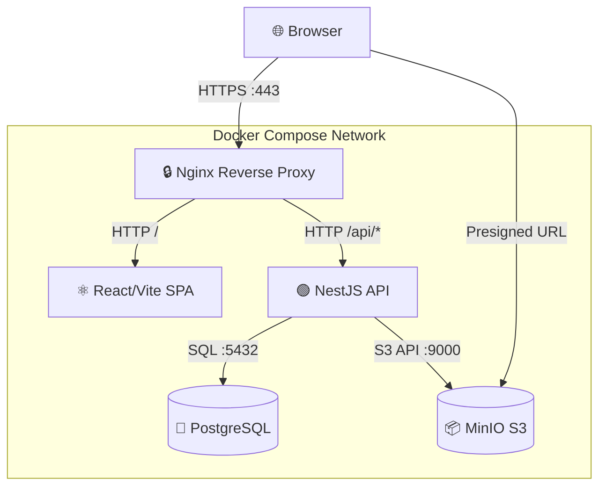
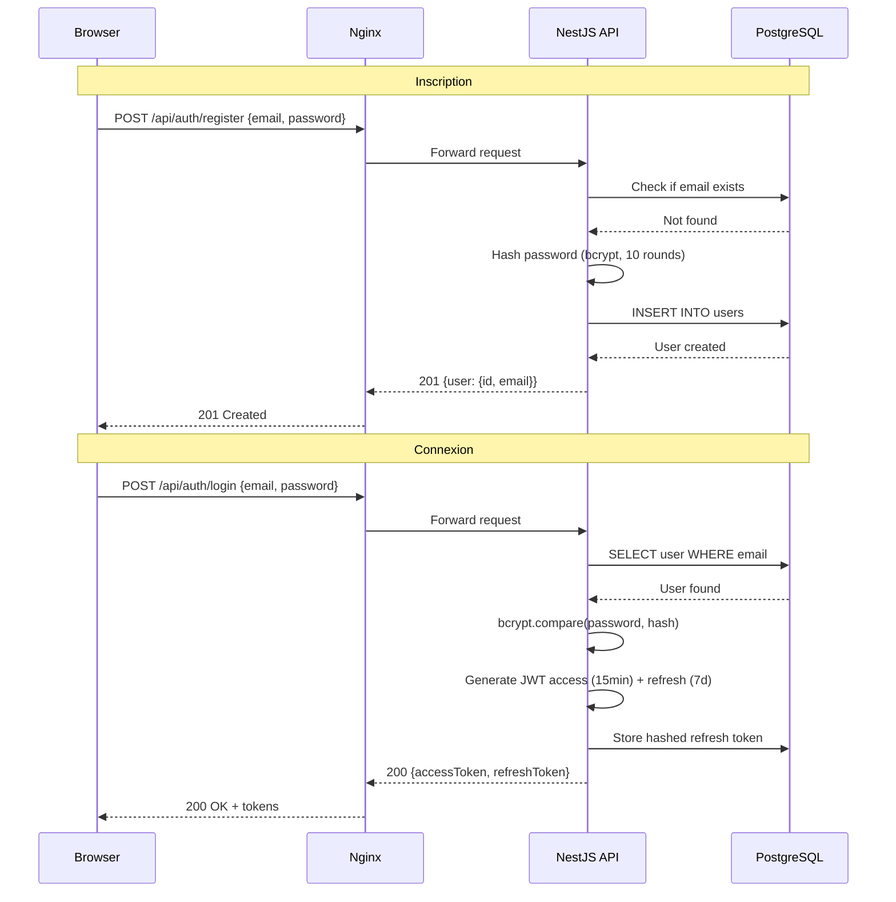
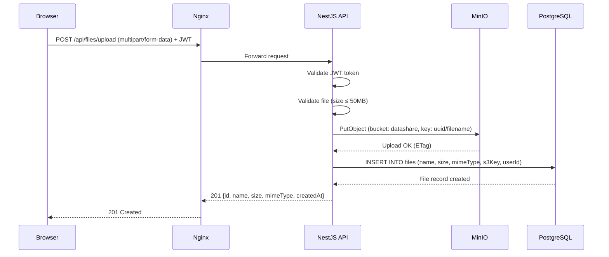
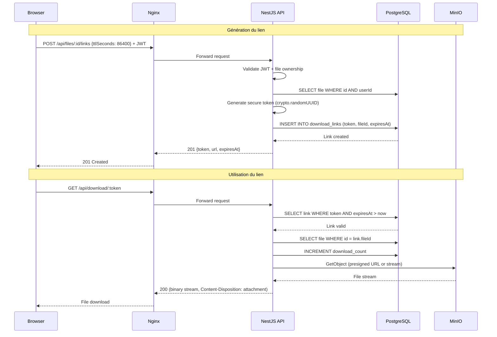
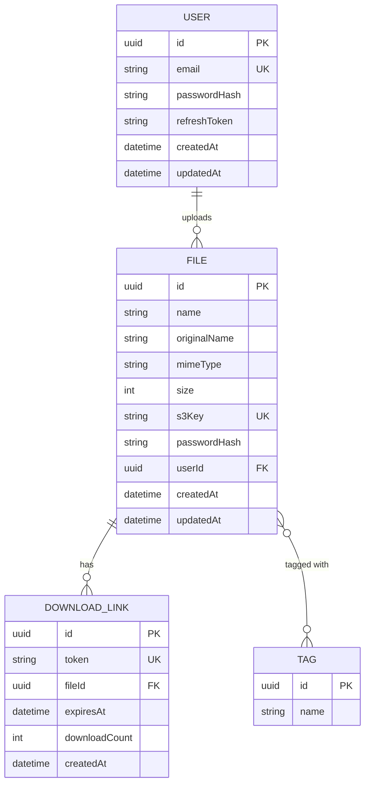

# Documentation Technique — DataShare

**Auteur :** Mathieu CHEREAU  
**Date :** Juin 2026  
**Projet :** P3 — Pilotez le développement d'une solution informatique  
**Version :** 1.0.0

---

## Table des matières

1. [Architecture de l'application](#1-architecture-de-lapplication)
2. [Choix technologiques justifiés](#2-choix-technologiques-justifiés)
3. [Modèle de données](#3-modèle-de-données)
4. [Documentation d'API](#4-documentation-dapi)
5. [Sécurité et gestion des accès](#5-sécurité-et-gestion-des-accès)
6. [Qualité, tests et maintenance](#6-qualité-tests-et-maintenance)
7. [Processus d'installation et d'exécution](#7-processus-dinstallation-et-dexécution)
8. [Utilisation de l'IA dans le développement](#8-utilisation-de-lia-dans-le-développement)

---

## 1. Architecture de l'application

### 1.1 Vue d'ensemble

DataShare est une plateforme de transfert sécurisé de fichiers conçue pour les freelances et petites entreprises. L'architecture suit un modèle **3-tiers classique** conteneurisé avec Docker Compose.

### 1.2 Diagramme d'architecture globale



### 1.3 Description des briques

| Brique | Rôle | Technologie | Port |
|--------|------|------------|------|
| **Nginx** | Reverse proxy, TLS termination, routing | Nginx 1.25 | 443, 80 |
| **Frontend** | SPA React (interface utilisateur) | React 18 + Vite 5 | 5173 |
| **Backend** | API REST (logique métier) | NestJS 10 + TypeScript | 3001 |
| **PostgreSQL** | Base de données relationnelle | PostgreSQL 16 | 5432 |
| **MinIO** | Stockage objet S3-compatible | MinIO (latest) | 9000, 9001 |

### 1.4 Flux de données

- **Browser → Nginx** : HTTPS/TLS (port 443)
- **Nginx → Frontend** : HTTP interne (proxy pass `/` → `frontend:5173`)
- **Nginx → Backend** : HTTP interne (proxy pass `/api/*` → `backend:3001`)
- **Backend → PostgreSQL** : TCP/SQL (port 5432, driver Prisma)
- **Backend → MinIO** : HTTP/S3 API (port 9000, SDK `minio-js`)
- **Browser → MinIO** : Presigned URLs pour téléchargement direct

### 1.5 Diagrammes de séquence

#### 1.5.1 Inscription + Connexion (JWT)



#### 1.5.2 Upload de fichier



#### 1.5.3 Génération et utilisation d'un lien temporaire



---

## 2. Choix technologiques justifiés

### 2.1 Frontend — React 18 + Vite 5 + TypeScript

**Justification :** React est le framework frontend le plus adopté (écosystème mature, pool de développeurs large). Vite offre un Hot Module Replacement instantané, idéal pour la vélocité MVP. TypeScript apporte la sécurité du typage statique dès le départ.

**Alternatives écartées :**
- **Next.js** : Trop lourd pour un SPA pur (SSR non nécessaire pour ce MVP)
- **Vue.js** : Écosystème plus restreint, moins de composants tiers matures

### 2.2 Backend — NestJS 10 + TypeScript

**Justification :** NestJS offre une architecture modulaire inspirée d'Angular (injection de dépendances, modules, guards, pipes). Il impose une structure de code propre dès le départ, ce qui donne confiance aux investisseurs sur la maintenabilité. TypeScript partagé avec le frontend permet une cohérence stack complète.

**Alternatives écartées :**
- **Express** : Trop minimaliste, nécessite beaucoup de setup pour atteindre le même niveau de structure
- **FastAPI (Python)** : Excellent framework mais aurait imposé deux langages dans le projet

### 2.3 Base de données — PostgreSQL 16 + Prisma ORM

**Justification :** PostgreSQL est la base relationnelle open-source la plus robuste. Prisma offre un ORM type-safe avec des migrations auto-générées et un client TypeScript natif. Le schéma Prisma sert de source de vérité pour le modèle de données.

### 2.4 Stockage fichiers — MinIO (S3-compatible)

**Justification :** MinIO est 100% compatible S3 et self-hosted. Il permet de développer localement avec la même API que S3 AWS, facilitant une migration cloud future. Zéro coût d'infrastructure pour le MVP.

### 2.5 Reverse Proxy — Nginx

**Justification :** Nginx gère la terminaison TLS, le routing (frontend `/` vs backend `/api/*`), et la compression gzip. Configuration simple et éprouvée en production.

### 2.6 Authentification — JWT + Refresh Tokens

**Justification :** JWT avec access tokens courts (15 min) et refresh tokens longs (7 jours) offre un bon compromis sécurité/UX. Le refresh token est hashé en base (bcrypt) et révocable lors du logout. Pas besoin de session serveur (stateless).

### 2.7 Containerisation — Docker Compose

**Justification :** Docker Compose permet de lancer l'intégralité de la stack en une seule commande (`make up`). Reproductibilité garantie pour la démo investisseurs et le développement local.

### 2.8 Testing — Jest + Playwright + k6

| Couche | Outil | Usage |
|--------|-------|-------|
| Tests unitaires | Jest | Services, controllers, guards |
| Tests E2E | Playwright | Parcours utilisateur complets |
| Tests de charge | k6 | Stress test upload/download |

### 2.9 Qualité de code — ESLint + Prettier

**Justification :** ESLint détecte les erreurs et anti-patterns TypeScript. Prettier formate automatiquement le code pour une cohérence totale. Configuration partagée frontend/backend.

---

## 3. Modèle de données

### 3.1 Schéma Prisma (source de vérité)

```prisma
generator client {
  provider = "prisma-client-js"
}

datasource db {
  provider = "postgresql"
  url      = env("DATABASE_URL")
}

model User {
  id           String   @id @default(uuid())
  email        String   @unique
  passwordHash String
  refreshToken String?
  createdAt    DateTime @default(now())
  updatedAt    DateTime @updatedAt
  files        File[]
}

model File {
  id            String         @id @default(uuid())
  name          String
  originalName  String
  mimeType      String
  size          Int
  s3Key         String         @unique
  passwordHash  String?
  userId        String?
  user          User?          @relation(fields: [userId], references: [id])
  tags          Tag[]
  downloadLinks DownloadLink[]
  createdAt     DateTime       @default(now())
  updatedAt     DateTime       @updatedAt
}

model DownloadLink {
  id            String   @id @default(uuid())
  token         String   @unique
  fileId        String
  file          File     @relation(fields: [fileId], references: [id], onDelete: Cascade)
  expiresAt     DateTime
  downloadCount Int      @default(0)
  createdAt     DateTime @default(now())
}

model Tag {
  id    String @id @default(uuid())
  name  String
  files File[]
}
```

### 3.2 Diagramme entité-relation (ERD)



### 3.3 Description des entités

| Entité | Description | Clé primaire | Relations |
|--------|-------------|-------------|-----------|
| **User** | Utilisateur inscrit sur la plateforme | `id` (UUID) | 1:N → File |
| **File** | Fichier uploadé et stocké sur MinIO | `id` (UUID) | N:1 → User, 1:N → DownloadLink, M:N → Tag |
| **DownloadLink** | Lien temporaire de téléchargement | `id` (UUID) | N:1 → File (cascade delete) |
| **Tag** | Étiquette pour organiser les fichiers | `id` (UUID) | M:N → File |

---

## 4. Documentation d'API

### 4.1 Vue d'ensemble

L'API REST est exposée sous `/api/*` via le reverse proxy Nginx. Toutes les routes authentifiées nécessitent un header `Authorization: Bearer <accessToken>`.

### 4.2 Routes d'authentification

| Méthode | Chemin | Auth | Description |
|---------|--------|------|-------------|
| `POST` | `/api/auth/register` | Non | Inscription |
| `POST` | `/api/auth/login` | Non | Connexion → tokens |
| `POST` | `/api/auth/logout` | JWT | Révocation refresh token |
| `POST` | `/api/auth/refresh` | Non | Renouvellement access token |

**POST /api/auth/register**
```json
// Request
{ "email": "user@example.com", "password": "SecureP@ss1" }
// Response 201
{ "user": { "id": "uuid", "email": "user@example.com" } }
```

**POST /api/auth/login**
```json
// Request
{ "email": "user@example.com", "password": "SecureP@ss1" }
// Response 200
{ "accessToken": "eyJ...", "refreshToken": "eyJ..." }
```

**POST /api/auth/refresh**
```json
// Request
{ "refreshToken": "eyJ..." }
// Response 200
{ "accessToken": "eyJ...(new)", "refreshToken": "eyJ...(new)" }
```

### 4.3 Routes fichiers

| Méthode | Chemin | Auth | Description |
|---------|--------|------|-------------|
| `POST` | `/api/files/upload` | JWT | Upload fichier (multipart) |
| `GET` | `/api/files` | JWT | Lister ses fichiers |
| `GET` | `/api/files/:id` | JWT | Métadonnées d'un fichier |
| `DELETE` | `/api/files/:id` | JWT | Supprimer un fichier |
| `PUT` | `/api/files/:id/password` | JWT | Définir mot de passe |
| `POST` | `/api/files/:id/links` | JWT | Générer lien temporaire |
| `POST` | `/api/files/:id/tags` | JWT | Ajouter des tags |
| `DELETE` | `/api/files/:id/tags` | JWT | Retirer des tags |

**POST /api/files/upload** (multipart/form-data)
```
Headers: Authorization: Bearer <token>
Body: file (binary), Content-Type: multipart/form-data
Response 201:
{ "id": "uuid", "name": "document.pdf", "size": 204800, "mimeType": "application/pdf", "createdAt": "2026-06-01T..." }
```

**GET /api/files** (liste paginée)
```
Headers: Authorization: Bearer <token>
Query: ?page=1&limit=20&search=doc&tag=important
Response 200:
{
  "data": [{ "id": "uuid", "name": "doc.pdf", "size": 204800, ... }],
  "meta": { "total": 42, "page": 1, "limit": 20, "totalPages": 3 }
}
```

**POST /api/files/:id/links**
```json
// Request
{ "ttlSeconds": 86400 }
// Response 201
{ "token": "abc-def-123", "url": "/api/download/abc-def-123", "expiresAt": "2026-06-02T..." }
```

### 4.4 Route de téléchargement (publique)

| Méthode | Chemin | Auth | Description |
|---------|--------|------|-------------|
| `GET` | `/api/download/:token` | Non | Télécharger via lien temporaire |
| `POST` | `/api/download/:token` | Non | Télécharger (avec mot de passe) |

**GET /api/download/:token**
```
Response 200: Binary stream (Content-Disposition: attachment; filename="doc.pdf")
Response 401: { "error": "Password required" }
Response 404: { "error": "Link expired or not found" }
```

### 4.5 Codes d'erreur standards

| Code | Signification |
|------|--------------|
| 200 | Succès |
| 201 | Ressource créée |
| 400 | Requête invalide (validation) |
| 401 | Non authentifié / token invalide |
| 403 | Non autorisé (pas propriétaire) |
| 404 | Ressource non trouvée |
| 409 | Conflit (email déjà existant) |
| 413 | Fichier trop volumineux (> 50MB) |
| 500 | Erreur serveur interne |

---

## 5. Sécurité et gestion des accès

### 5.1 Authentification JWT

- **Access Token** : JWT signé HS256, TTL 15 minutes
- **Refresh Token** : JWT signé HS256, TTL 7 jours
- **Stockage** : Le refresh token est hashé (bcrypt 10 rounds) avant stockage en base
- **Révocation** : Le logout supprime le refresh token hashé en base
- **Rotation** : Chaque refresh génère un nouveau couple access + refresh

### 5.2 Protection des mots de passe

- Hachage bcrypt avec salt factor 10
- Validation côté API : minimum 8 caractères, au moins une majuscule, un chiffre
- Les mots de passe ne sont jamais loggés ni retournés dans les réponses

### 5.3 Mots de passe fichiers

- Optionnel, défini par le propriétaire (`PUT /api/files/:id/password`)
- Hashé bcrypt (10 rounds) en base
- Vérifié lors du téléchargement si défini

### 5.4 Liens de téléchargement sécurisés

- Token unique généré par `crypto.randomUUID()`
- TTL configurable (1h, 24h, 7j)
- Compteur de téléchargements
- Suppression en cascade quand le fichier est supprimé

### 5.5 Contrôle d'accès (RBAC simplifié)

- Chaque fichier appartient à un utilisateur (`userId`)
- Seul le propriétaire peut : lister, supprimer, générer des liens, ajouter des tags
- Upload anonyme possible (fichier sans `userId`)
- Téléchargement : accès public via token valide + mot de passe si défini

### 5.6 Sécurité réseau

- **HTTPS/TLS** : Terminaison TLS au niveau Nginx (certificats auto-signés pour le dev)
- **Réseau Docker isolé** : Les services communiquent sur un réseau interne Docker
- **Pas d'exposition directe** : PostgreSQL et MinIO ne sont pas exposés sur le host en production

### 5.7 Secrets et configuration

- Tous les secrets sont externalisés via variables d'environnement
- `.env` non versionné (dans `.gitignore`)
- `.env.example` fourni avec des valeurs fictives
- Fail-fast : l'application refuse de démarrer si un secret obligatoire manque

### 5.8 Headers de sécurité (Nginx)

```nginx
add_header X-Frame-Options "SAMEORIGIN";
add_header X-Content-Type-Options "nosniff";
add_header X-XSS-Protection "1; mode=block";
add_header Strict-Transport-Security "max-age=31536000; includeSubDomains";
```

---

## 6. Qualité, tests et maintenance

### 6.1 Stratégie de tests

DataShare utilise une approche **multi-couches** :

| Couche | Outil | Fichiers | Tests |
|--------|-------|----------|-------|
| Tests unitaires | Jest | `*.spec.ts` | 40+ |
| Tests E2E | Playwright | `e2e/tests/*.spec.ts` | 10 specs |
| Tests de charge | k6 | `k6/upload-test.js` | Stress test |

### 6.2 Tests unitaires (Jest)

```bash
cd backend && npm test        # Lancer les tests
cd backend && npm run test:cov  # Avec couverture
```

**Seuils de couverture :**

| Métrique | Seuil | Actuel |
|----------|-------|--------|
| Statements | 70% | 72.82% |
| Branches | 50% | 80% |
| Functions | 60% | 66.66% |
| Lines | 70% | 72.31% |

**Fichiers testés :**

| Service | Tests | Description |
|---------|-------|-------------|
| `auth.service.spec.ts` | 14 | Register, login, logout, refresh, JWT |
| `auth.controller.spec.ts` | 4 | Endpoints du contrôleur |
| `files.service.spec.ts` | 8 | Upload, list, delete, password, tags |
| `download.service.spec.ts` | 6 | Create link, download, expiry, password |
| `jwt.guard.spec.ts` | 4 | Validation JWT, guard behavior |

### 6.3 Tests E2E (Playwright)

10 spécifications couvrant les user stories :

| Spec | User Story | Description |
|------|-----------|-------------|
| `us01-upload.spec.ts` | US01 | Upload de fichier |
| `us02-download-links.spec.ts` | US02 | Liens de téléchargement |
| `us03-register.spec.ts` | US03 | Inscription |
| `us04-login.spec.ts` | US04 | Connexion |
| `us05-file-list.spec.ts` | US05 | Liste des fichiers |
| `us06-stats.spec.ts` | US06 | Statistiques |
| `us07-password.spec.ts` | US07 | Protection mot de passe |
| `us08-anonymous-upload.spec.ts` | US08 | Upload anonyme |
| `us09-tags.spec.ts` | US09 | Tags |
| `us10-history.spec.ts` | US10 | Historique |

### 6.4 Tests de performance (k6)

```bash
k6 run k6/upload-test.js
```

Scénarios : upload séquentiel, upload concurrent (10 VUs), montée en charge progressive.

### 6.5 Plan de maintenance

- **Mises à jour dépendances** : Audit mensuel (`npm audit`, Dependabot)
- **Monitoring** : Logs structurés JSON, health checks Docker
- **Backups** : PostgreSQL (pg_dump quotidien), MinIO (bucket replication)
- **Rotation des secrets** : JWT_SECRET roté trimestriellement
- Voir `MAINTENANCE.md` pour le plan détaillé

### 6.6 Qualité de code

- **Linting** : ESLint avec règles TypeScript strictes
- **Formatage** : Prettier (auto-format on save)
- **Conventional Commits** : `feat:`, `fix:`, `chore:`, `docs:`, etc.
- **Pull Requests** : Chaque feature dans une branche dédiée, review avant merge
- **Squash merge** : Historique Git propre et linéaire

---

## 7. Processus d'installation et d'exécution

### 7.1 Prérequis

| Outil | Version minimum |
|-------|----------------|
| Docker | 24+ |
| Docker Compose | v2+ |
| Node.js | 20+ (optionnel, pour dev local) |
| Make | 3.8+ |

### 7.2 Installation rapide

```bash
# 1. Cloner le repository
git clone git@github.com:OC-Expert-DevOps/P3-OC-software-development-management.git
cd P3-OC-software-development-management

# 2. Copier la configuration
cp .env.example .env

# 3. Lancer la stack complète
make up

# 4. Appliquer les migrations de base de données
make migrate

# 5. Accéder à l'application
# Frontend : https://localhost
# API :     https://localhost/api
# MinIO :   http://localhost:9001
```

### 7.3 Commandes Makefile

| Commande | Description |
|----------|-------------|
| `make up` | Démarrer tous les services |
| `make down` | Arrêter tous les services |
| `make logs` | Afficher les logs en temps réel |
| `make migrate` | Exécuter les migrations Prisma |
| `make test` | Lancer les tests unitaires |
| `make test-e2e` | Lancer les tests E2E Playwright |
| `make build` | Builder les images Docker |
| `make clean` | Supprimer volumes et données |

### 7.4 Variables d'environnement

| Variable | Obligatoire | Type | Défaut | Description |
|----------|-------------|------|--------|-------------|
| `DATABASE_URL` | Oui | url | — | URL PostgreSQL |
| `JWT_SECRET` | Oui | string | — | Clé de signature JWT |
| `MINIO_ENDPOINT` | Oui | string | — | Hostname MinIO |
| `MINIO_PORT` | Non | int | 9000 | Port API MinIO |
| `MINIO_ACCESS_KEY` | Oui | string | — | Clé d'accès MinIO |
| `MINIO_SECRET_KEY` | Oui | string | — | Clé secrète MinIO |
| `MINIO_BUCKET` | Non | string | datashare | Nom du bucket |
| `MINIO_USE_SSL` | Non | bool | false | SSL pour MinIO |
| `CORS_ORIGIN` | Non | string | * | Origines CORS autorisées |

### 7.5 Structure du projet

```
P3-OC-software-development-management/
├── backend/              ← API NestJS
│   ├── src/
│   │   ├── auth/         ← Module authentification
│   │   ├── files/        ← Module gestion fichiers
│   │   ├── download/     ← Module téléchargement
│   │   ├── minio/        ← Module stockage S3
│   │   └── prisma/       ← Module ORM
│   ├── prisma/schema.prisma
│   └── Dockerfile
├── frontend/             ← SPA React/Vite
│   ├── src/
│   │   ├── pages/        ← Pages (Login, Register, Upload, Dashboard, Download)
│   │   ├── components/   ← Composants réutilisables
│   │   ├── hooks/        ← Custom hooks (useAuth)
│   │   └── api/          ← Client HTTP Axios
│   └── Dockerfile
├── e2e/                  ← Tests E2E Playwright
├── infra/                ← Docker Compose + Nginx
├── k6/                   ← Tests de charge
├── docs/                 ← Documentation technique
└── memory-bank/          ← Documentation d'implémentation
```

---

## 8. Utilisation de l'IA dans le développement

### 8.1 Outils IA utilisés

| Outil | Usage | Supervision |
|-------|-------|------------|
| **GitHub Copilot** | Autocomplétion code, suggestions | Chaque suggestion relue et validée manuellement |
| **Claude (Anthropic)** | Architecture, documentation, refactoring | Prompts supervisés, résultats vérifiés et adaptés |

### 8.2 Méthodologie de supervision

L'utilisation de l'IA a suivi un processus strict de supervision :

1. **Prompt engineering** : Chaque demande à l'IA est formulée avec contexte précis (stack, contraintes, conventions)
2. **Revue systématique** : Tout code généré est relu, testé et adapté au projet
3. **Documentation des interactions** : Les prompts clés et leurs résultats sont documentés dans `docs/ai-usage/`
4. **Validation fonctionnelle** : Chaque contribution IA est validée par des tests (unitaires + E2E)

### 8.3 Exemples d'utilisation supervisée

#### Architecture initiale
- **Prompt** : Conception de l'architecture 3-tiers avec justification des choix technologiques
- **Résultat** : Diagrammes Mermaid (architecture, séquence, ERD), contrat OpenAPI
- **Supervision** : Adaptation aux contraintes spécifiques du projet (MinIO local, Prisma ORM)

#### Module d'authentification
- **Prompt** : Implémentation JWT avec refresh tokens et guards NestJS
- **Résultat** : Code du AuthModule (controller, service, DTOs, guard)
- **Supervision** : Vérification de la sécurité (bcrypt rounds, validation input, error messages)

#### Tests E2E
- **Prompt** : Création des scénarios Playwright pour les 10 user stories
- **Résultat** : 10 fichiers de specs E2E avec fixtures d'authentification
- **Supervision** : Adaptation aux sélecteurs réels du frontend, ajout de cas limites

#### Interface utilisateur
- **Prompt** : Alignement du frontend sur les maquettes Figma DataShare
- **Résultat** : Refonte visuelle des 6 pages (Login, Register, Upload, Dashboard, Download, Navbar)
- **Supervision** : Vérification pixel-perfect avec les maquettes, ajustements de style

### 8.4 Bilan

L'IA a permis d'accélérer significativement le développement du MVP (estimation : gain de 40-50% sur le temps de développement), tout en maintenant un niveau de qualité élevé grâce à la supervision systématique. Aucun code n'a été intégré "tel quel" sans relecture et validation.

---

*Document généré le 19 juin 2026 — DataShare v1.0.0*
